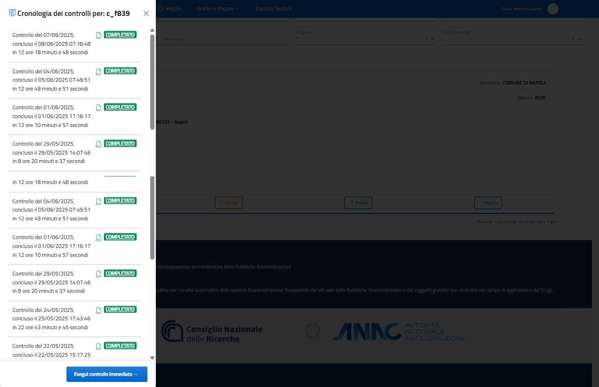

Funzione "Controlli" - Cronologia controlli
============================

Il tasto “Controlli” attiva la funzione di Scan-On-Demand (SOD) che permette di avviare un controllo immediato per l’Amministrazione selezionata con la scelta dell’albero di regole da applicare (è possibile effettuare scansioni con alberi differenti per la medesima Amministrazione).
Tramite la medesima funzione, si accede all’elenco cronologico delle scansioni effettuate (cronologia dei controlli), alle relative informazioni generali (data, orario, tempo di scansione, ecc.), ai risultati delle singole verifiche effettuate. I dati di ogni scansione possono essere esportati dal sistema (per elaborazioni o interscambio) in file di testo con formato CSV.

L'accesso alla funzione Scan-On-Demand avviane attraverso il tasto "Effettua controllo immediato".

.. _controlli-scan-on-demand-img:

  Funzione "Controlli" e "Effettua controllo immediato"
