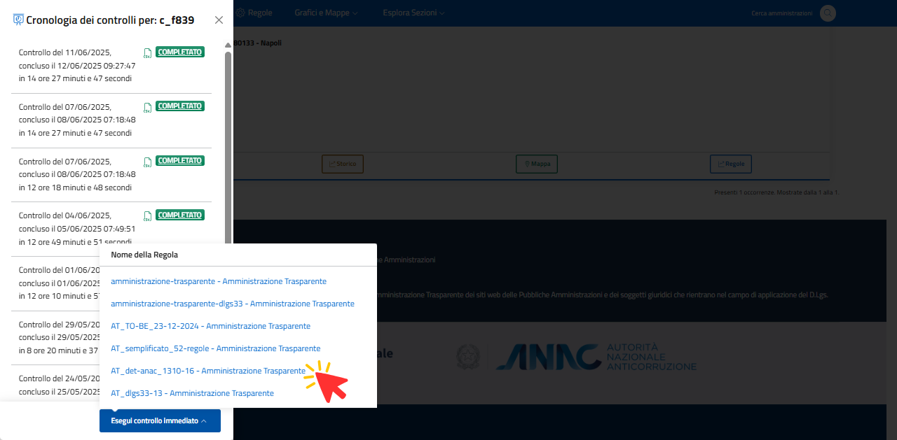

Funzione "Controlli" - Cronologia controlli e Scan On Demand (SOD)
==================================================================

Il tasto “Controlli” attiva la finestra laterale (:numref:`controlli-img`) con accesso all’elenco cronologico delle scansioni effettuate (cronologia dei controlli), alle relative informazioni generali (data, orario, tempo di scansione, ecc.), ai risultati delle singole verifiche effettuate. I dati di ogni scansione possono essere esportati dal sistema (per elaborazioni o interscambio) in un file di testo in formato CSV.

.. _controlli-img:
.. figure:: images/ui-cerca_amministrazioni_esempio-controlli.png
  :width: 800
  :alt: Funzione "Controlli"

  Funzione "Controlli"

Il tasto "Effettua controllo immediato" (:numref:`controlli-scan-on-demand-img`) attiva la **funzione Scan On Demand** (SOD) che avvia una scansione immediata del sito web dell'Amministrazione selezionata con possibilità di scelta dell’albero di regole da applicare (scansioni con alberi differenti per la medesima Amministrazione).

.. _controlli-scan-on-demand-img:

  Funzione Scan On Demand
