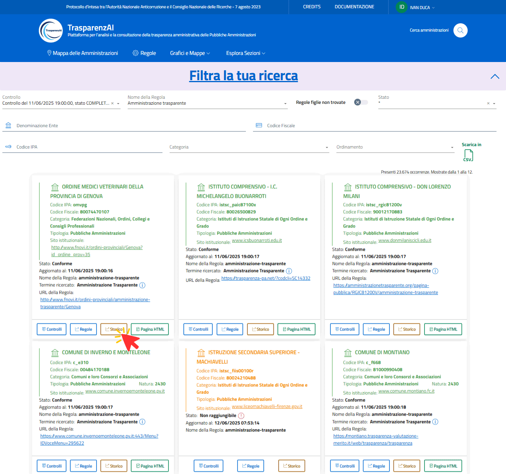
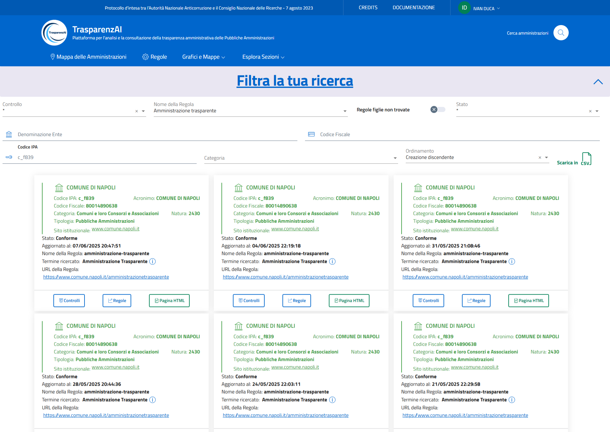
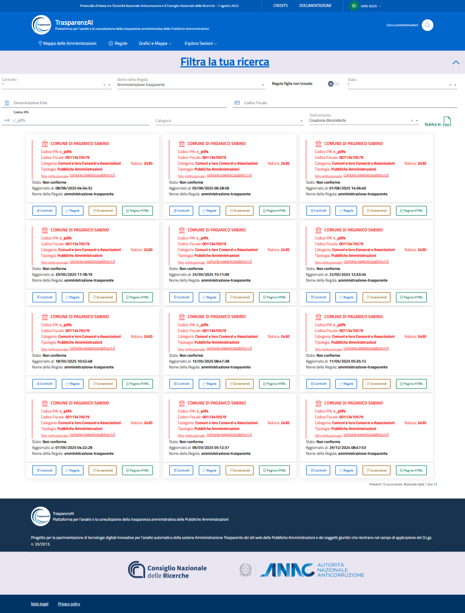

Funzione "Storico" - Cronologia controlli
=========================================

Il tasto “Storico” (:numref:`storico-1-img`) attiva la funzione che visualizza la cronologia delle scansioni effettuate (cronologia dei controlli) per ogni Amministrazione, con le relative informazioni generali (data, orario, tempo di scansione, ecc.) e i risultati delle verifiche effettuate. I dati di ogni scansione possono essere esportati dal sistema (per elaborazioni o interscambio) con file di testo in formato CSV.
La colorazione (verde, verde chiaro, arancione, rosso) della sezione intestazione di ogni scansione mostra lo stato relativo alla rilevazione della sezione "Amministrazione Trasparente" nella homepage del sito web dell'Amministrazione selezionata (conforme, conforme con testo alternativo, non raggiungibile, non trovato).

.. _storico-img:

  Funzione "Storico"

Le figure di esempio :numref:`storico-1-img`, :numref:`storico-2-img` e :numref:`storico-3-img` mostrano la cronologia storica di scansioni effettuate per Amministrazioni differenti.

.. _storico-1-img:

  Funzione "Storico" - esempio 1
 
.. _storico-2-img:
.. figure:: images/ui-storico-controlli_esempio-2.png
  :width: 800
  :alt: Funzione "Storico" - esempio 2

  Funzione "Storico" - esempio 2

.. _storico-3-img:

  Funzione "Storico" - esempio 3
