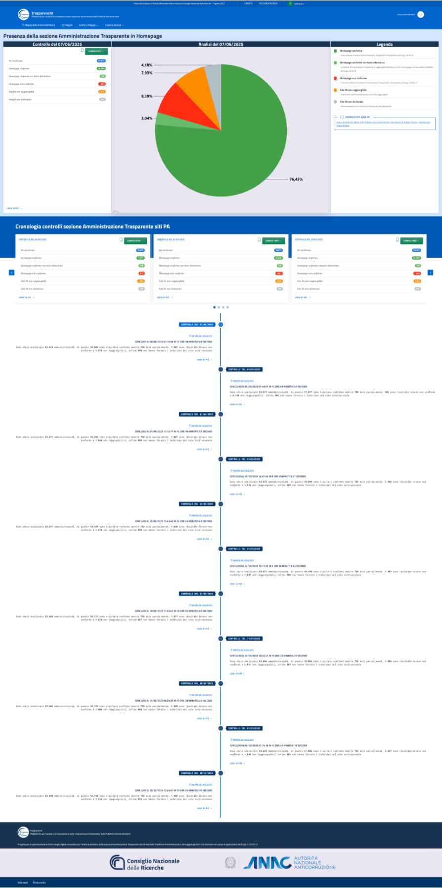
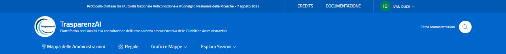
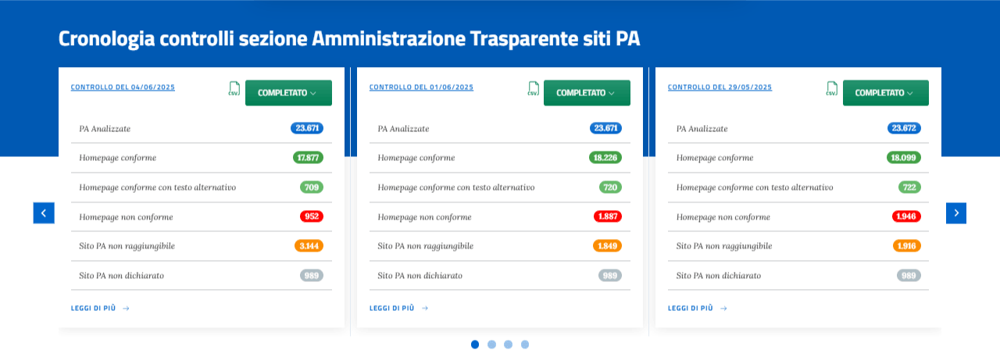
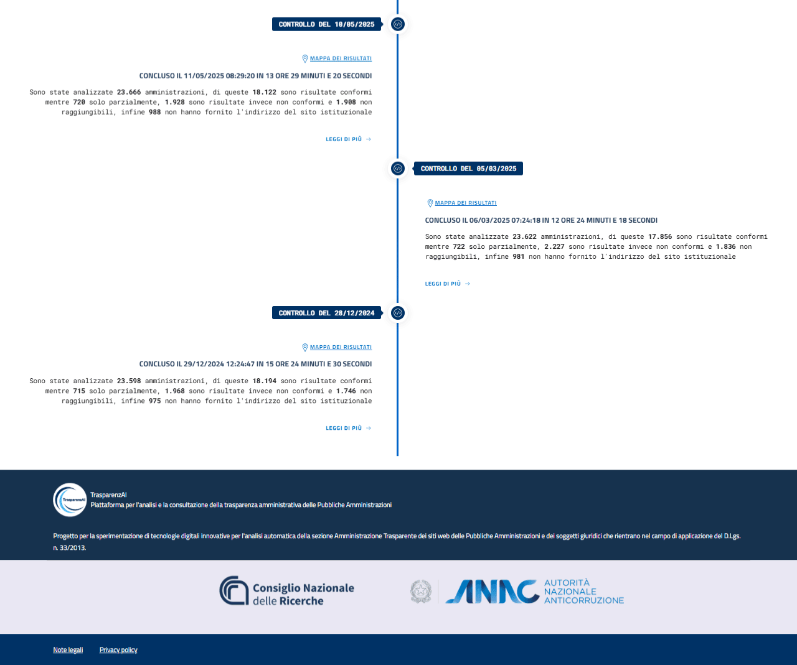

Homepage
========

La homepage (:numref:`home-img`) della piattaforma TrasparenzAI è stata progettata per garantire immediatezza e semplicità nella consultazione dei risultati ottenuti. L'interfaccia mostra chiaramente i dati relativi all’ultima scansione effettuata, fornendo un quadro sintetico del numero di pubbliche amministrazioni analizzate e della conformità riscontrata. È possibile visualizzare la cronologia dettagliata dei controlli precedenti, ciascuno accompagnato da un report scaricabile in formato CSV, e una timeline interattiva che permette di consultare rapidamente l’evoluzione dei controlli nel tempo.

.. _home-img:

  Interfaccia Web - Homepage

Header (intestazione)
---------------------

Nella parte superiore della homepage (:numref:`home-header-img`) sono presenti:
#. La barra superiore con il link al protocollo di collaborazione tra Consiglio Nazionale delle Ricerche e Autorità Nazionale Anticorruzione nell'ambito del quale è stato sviluppata la **piattaforma TrasparenzAI** (`Protocollo d’intesa tra l’Autorità Nazionale Anticorruzione e il Consiglio Nazionale delle Ricerche del 7 agosto 2023 <https://www.anticorruzione.it/-/protocollo-d-intesa-tra-l-autorit%C3%A0-nazionale-anticorruzione-e-il-consiglio-nazionale-delle-ricerche-7-agosto-2023>`__) e i link di accesso rapido a credits, documentazione, login.
#. Il menu di navigazione principale per l'accesso alle principali funzioni "Cerca amministrazioni", "Mappa delle Amministrazioni", "Regole", "Grafici e Mappe", "Esplora Sezioni". Il Menù è responsive e può essere collassato su dispositivi mobili.

.. _home-header-img:

  Header (intestazione)

Sezione ultimo controllo
------------------------

La homepage mostra i principali dati dell'ultimo controllo eseguito con una layout a griglia con card (:numref:`home-ultimo-controllo-img`).
La prima card illustra i dati ragruppati per stato, la card centrale invece mostra una torta con le percentuali degli stati la cui legenda è esplicitata nell'ultima card a destra.

.. _home-ultimo-controllo-img:
.. figure:: images/ui-homepage_sez-1.png
  :width: 800
  :alt: Sezione ultimo controllo

  Sezione ultimo controllo

Sezione cronologia dei controlli
--------------------------------

La piattaforma offre un riepilogo visivo delle scansioni precedenti, ciascuna con dati sintetici e la possibilità di esportare i risultati.
La sezione è composta da un carousel che permette di scorrere la cronologia dei controlli memorizzati dal sistema. Le informazioni includono data e ora del controllo, numero di amministrazioni analizzate, conformità rilevate. Qualora si abbia il ruolo necessario, è possibile l'esportazione in formato *csv* dei dati.
Il link *"LEGGI DI PIU' ->"* mostra la distribuzione geografica dei dati del singolo controllo (:numref:`home-cronologia-controlli-img`).

.. _home-cronologia-controlli-img:

  Sezione cronologia dei controlli

Sezione timeline
----------------

La sezione in homepage presenta una timeline verticale delle scansioni con il riepilogo dei risultati ottenuti.
Ogni nodo nella linea del tempo consente di consultare nel dettaglio i dati della relativa scansione, fornendo una visione cronologica dell’attività di monitoraggio.
Per ogni nodo è anche presente un link attivo alla distribuzione geografica dei dati del singolo controllo (:numref:`home-timeline-img`).

.. _home-timeline-img:

  Sezione timeline
