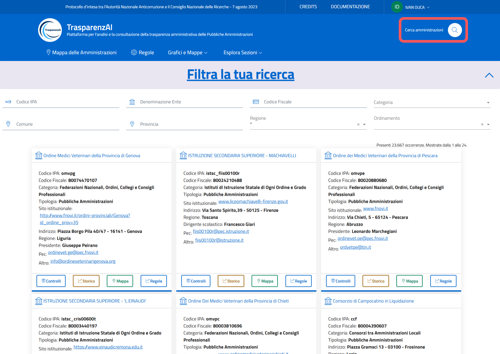
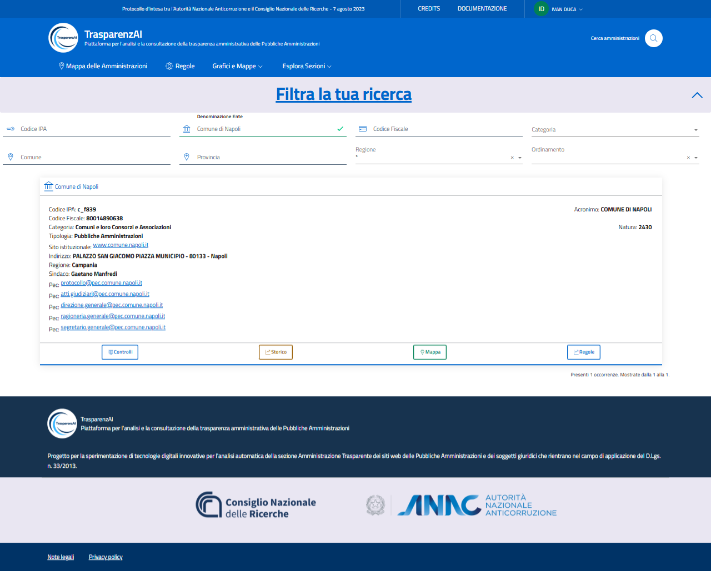

Menù "Cerca Amministrazioni"
============================

La piattaforma dispone di un sistema di ricerca avanzata che permette di individuare specifiche pubbliche amministrazioni utilizzando filtri come codice IPA, denominazione dell'ente, codice fiscale, categoria amministrativa, località (comune, provincia, regione). Questa funzionalità semplifica significativamente l’individuazione dell'Amministrazione di cui si ricercano le informazioni e i risultati del monitoraggio.
L’interfaccia di ricerca consente il filtraggio degli enti pubblici per Codice IPA, Denominazione Ente, Codice Fiscale, Categoria (es. Comuni, Istituti scolastici, Ordini professionali), Comune, Provincia, Regione e la selezione del criterio di ordinamento. La piattaforma fornisce le informazioni generali delle Amministrazioni e le funzioni "Controlli", "Storico", "Regole", "Mappe" con accesso diretto attraverso i tasti presenti nella schermata generale dell'Amministrazione selezionata.

.. _ricerca_amministrazioni-img:

  Menù - Cerca Amministrazioni

.. _esempio_ricerca_amministrazioni-img:

  *Esempio ricerca filtro "Denominazione Ente"*
