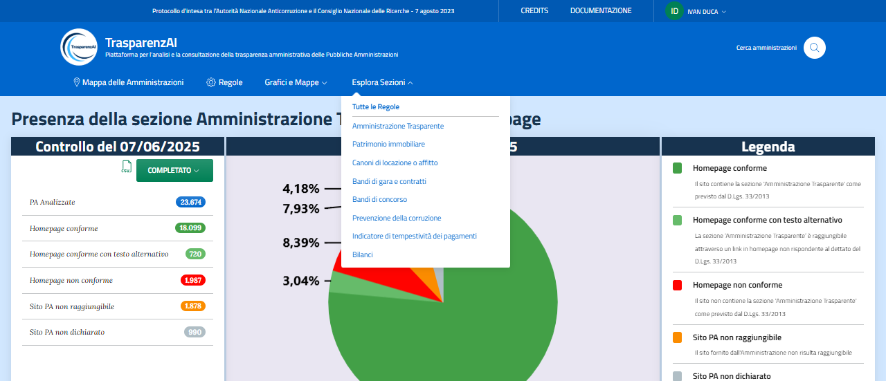
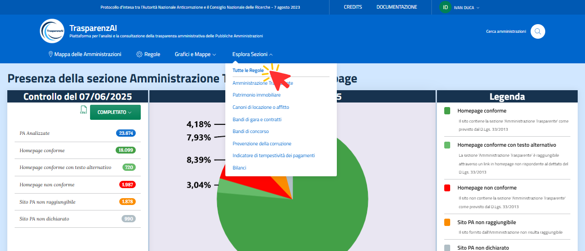
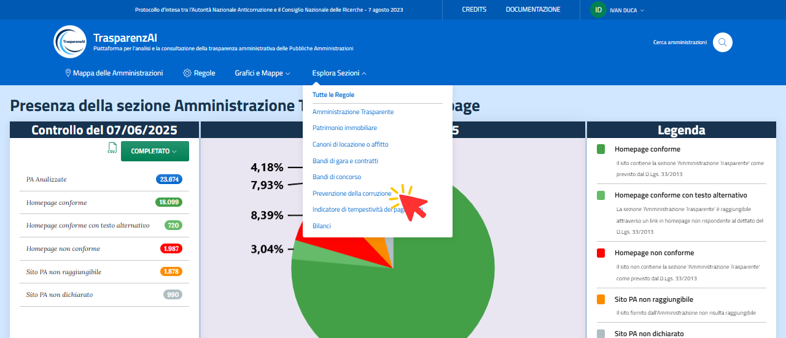
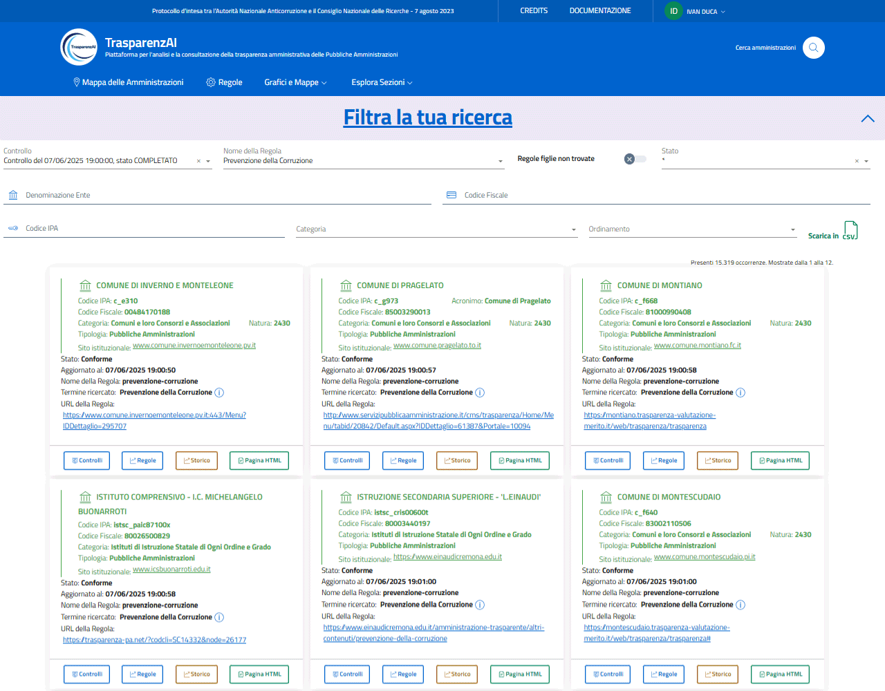
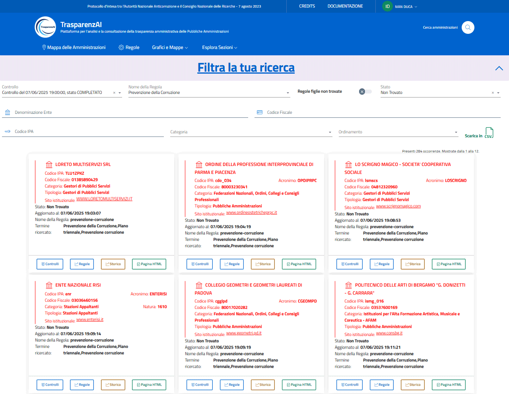

Menù "Esplora Sezioni"
======================

La voce di menù "Esplora Sezioni" permette di accedere alle funzioni di analisi filtrata dei dati. Il menù permette di accedere alla ricerca con filtro relativa ai controlli effettuati durante le scansioni temporali. E' possibile scegliere la scansione temporale, il nome della regola da verificare, lo stato, la denominazione dell'Amministrazione, il codice fiscale dell'Amministrazione, il codice IPA, la categoria.
Tutti i dati sono esportabili con file di interscambio in formato CSV.

.. _esplora-sezioni-menu-img:

  Menù "Esplora Sezioni"

La prima voce di menù "Tutte le Regole" permette la ricerca con selezione interamente configurabile dall'utente. Le ulteriori voci di menù offrono ricerche predefinite per specifiche sezioni: Amministrazione Trasparente, Patrimonio immobiliare, Canoni di locazione o affitto, Bandi di gara e contratti, Bandi di concorso, Prevenzione della corruzione, Indicatore di tempestività dei pagamenti, Bilanci.

.. _esplora-sezioni-tutte-le-regole-img:

  Menù "Esplora Sezioni" - Filtro "Tutte le Regole"

Le figure di seguito mostrano un esempio di selezione relative alla sezione "Prevenzione della corruzione" con tabelle relative a tutte la Amministrazioni ed alle sole Amministrazioni per le quali la sezione non è stata trovata sul sito web istituzionale.

.. _esplora-sezioni-prevenzione-corruzione-img:

  Menù "Esplora Sezioni" - Filtro "Prevenzione della corruzione"

.. _esplora-sezioni-prevenzione-corruzione-tutti-img:

  Menù "Esplora Sezioni" - Filtro "Prevenzione della corruzione" - tutte le Amministrazioni

.. _esplora-sezioni-prevenzione-corruzione-non-trovato-img:

  Menù "Esplora Sezioni" - Filtro "Prevenzione della corruzione" - stato "non trovato"
