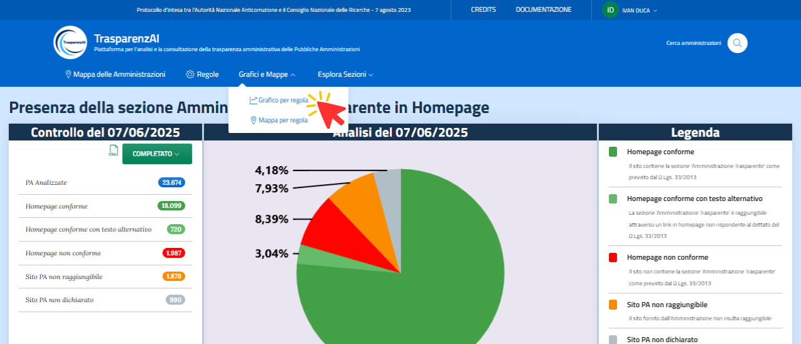
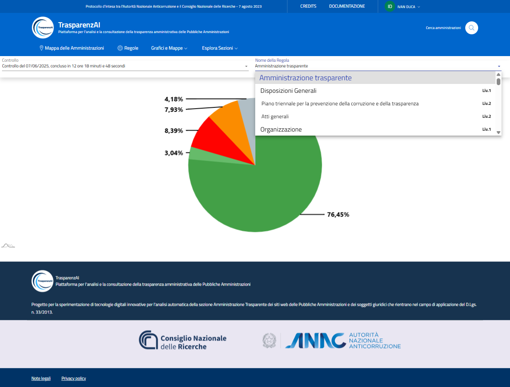
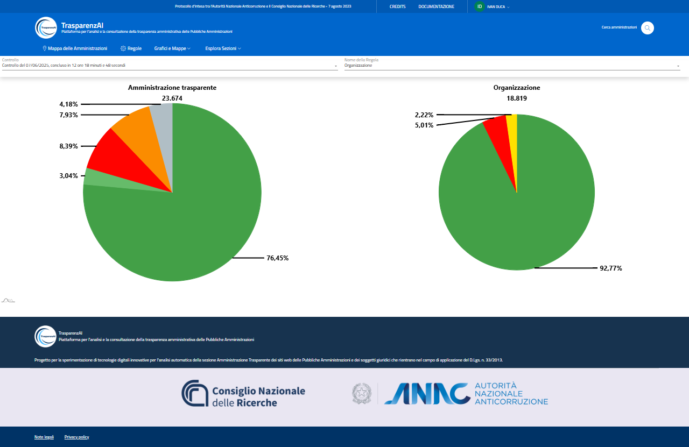
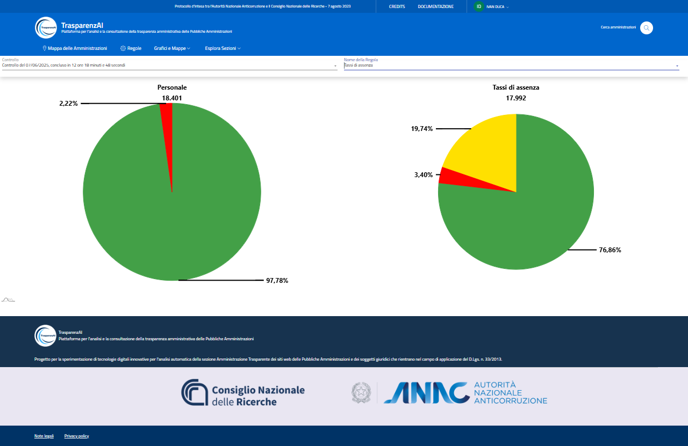

Menù "Grafico per regola"
=========================

La voce di menù "Grafico per regola" (:numref:`grafico-per-regola-menu-img`) permette di accedere alla rappresentazione grafica dei risultati generati da ogni scansione. 

.. _grafico-per-regola-menu-img:

  Menù "Grafico per regola"

Selezionando una sezione dell'albero delle regole, vengono visualizzati i dati in percentuale e numerici (muovendo il cursore del mouse sulle sezioni dei grafici a torta) relativi alla scansione in esame.

La :numref:`grafico-per-regola-esempio-1-img` mostra la visualizzazione dei risultati relativi alla sezione principale Amministrazione Trasparente per la scansione effettuata il 07/06/2025.

.. _grafico-per-regola-esempio-1-img:
.. figure:: images/ui-grafico_per_regola_esempio-1.png
  :width: 800
  :alt: Menù "Grafico per regola" - Regola "Amministrazione Trasparente" (radice albero)

  Menù "Grafico per regola" - Regola "Amministrazione Trasparente" (radice albero)

Il menù a tendina "Nome della Regola" (:numref:`grafico-per-regola-esempio-4-img`) permette la selezione dei dati di scansione relativi alle varie sezioni dell'albero delle regole.

.. _grafico-per-regola-esempio-4-img:

  Menù "Grafico per regola" - selezione "Nome della Regola" da visualizzare

Nelle figure :numref:`grafico-per-regola-esempio-2-img` e :numref:`grafico-per-regola-esempio-3-img` sono mostrati i risultati delle sezioni "Organizzazione" e "Tassi di assenza".

.. _grafico-per-regola-esempio-2-img:

  Menù "Grafico per regola" - Regola "Organizzazione"

.. _grafico-per-regola-esempio-3-img:

  Menù "Grafico per regola" - Regola "Tasso di assenza"

La visualizzazione congiunta del livello selezionato (a destra) e del livello superiore (a sinistra) dell'albero delle regole, permette la visualizzazione correlata delle sotto-sezioni con le relative sezioni superiori che le contengono (sezione padre).
