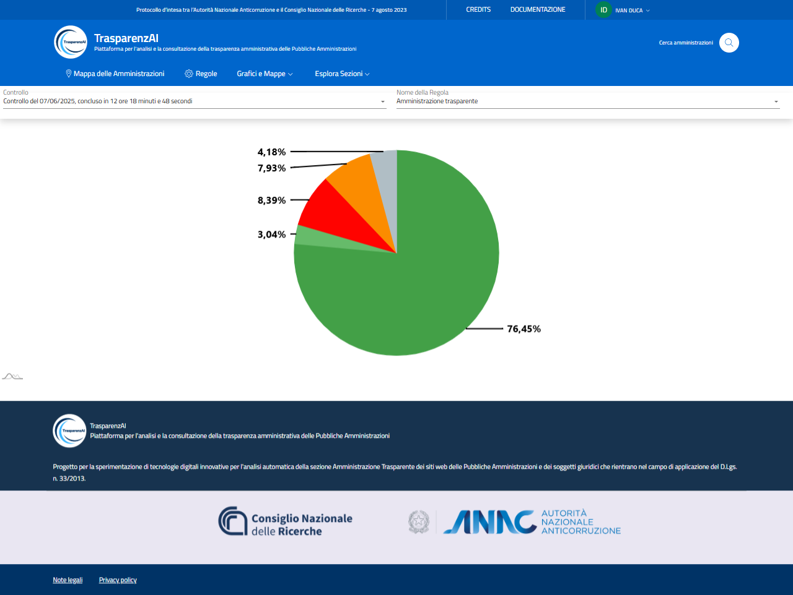

Menù "Grafici e Mappe" -> "Grafico per Regola"
==============================================

La voce di menù "Grafico per Regola" permette di accedere alla rappresentazione grafica dei risultati generati da ogni scansione. Per ogni sezione dell'albero delle regole esplorato, vengono forniti dati in percentuale e numerici (muovendo il cursore del maouse sulle sezioni dei grafici a torta).

La figura mostra la visualizzazione dei risultati relativi alla sezione principale Amministrazione Trasparente per la scansione effettuata il 07/06/2025.

.. _grafico-per-regola-esempio-1-img:

  Menù "Grafico per Regola" - Regola "Amministrazione Trasparente"

I dati di scansione relativi alle varie sezioni dell'albero delle regole, sono selezionabili dal menù a tendina "Nome della Regola".

.. _grafico-per-regola-esempio-3-img:
.. figure:: images/ui-garfico_per_regola_esempio-4.png
  :width: 800
  :alt: Menù "Grafico per Regola" - selezione "Nome della Regola"

  Menù "Grafico per Regola" - selezione "Nome della Regola" da visualizzare

Nelle figure successive sono mostrati i risultati delle sezioni "Organizzazione" e "Tassi di assenza".

.. _grafico-per-regola-esempio-2-img:
.. figure:: images/ui-garfico_per_regola_esempio-2.png
  :width: 800
  :alt: Menù "Grafico per Regola" - Organizzazione

  Menù "Grafico per Regola" - Regola "Organizzazione"

La visualizzazione congiunta del livello selezionato (a destra) e del livello superiore dell'lbero delle regole (a sinistra) permette una immediata visualizzazione correlata delle sezioni e sotto-sezioni.

.. _grafico-per-regola-esempio-3-img:
.. figure:: images/ui-garfico_per_regola_esempio-3.png
  :width: 800
  :alt: Menù "Grafico per Regola" - Tasso di assenza

  Menù "Grafico per Regola" - Regola "Tasso di assenza"
