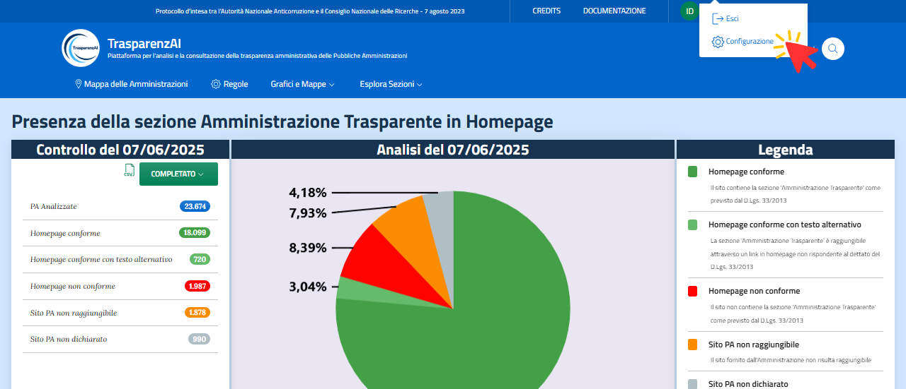
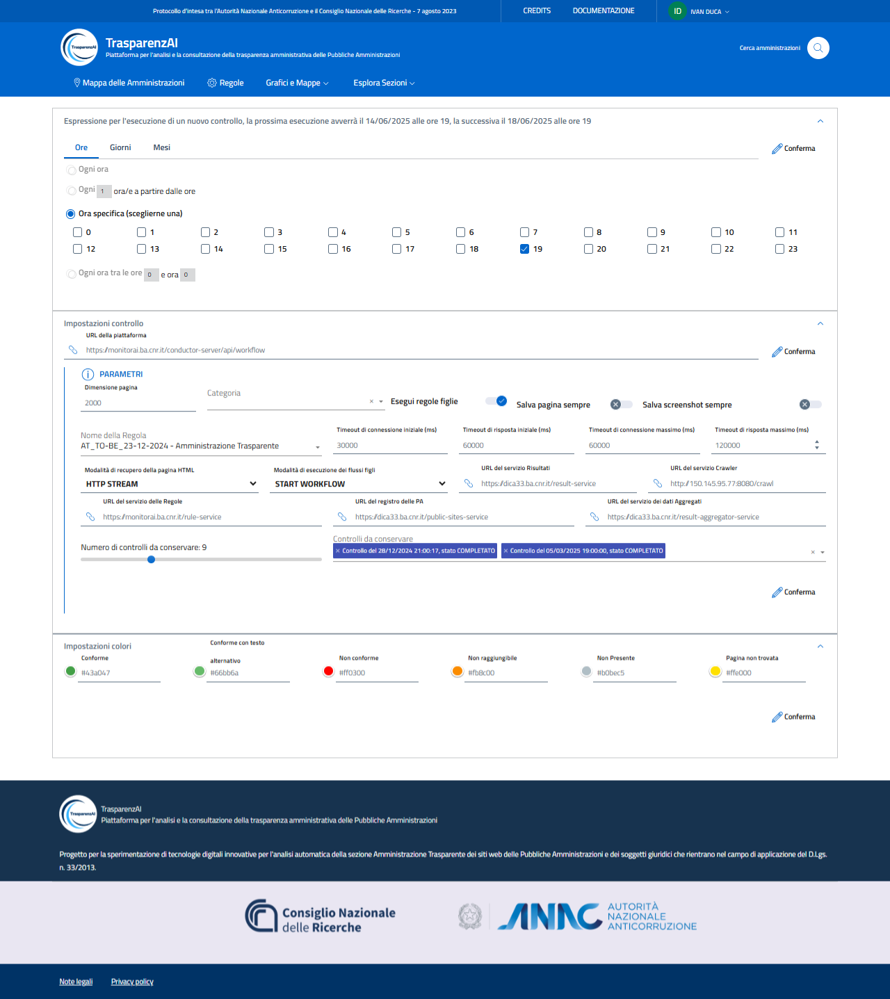

Menù "Accesso area riservata"
=============================

Dalla barra di menù presente nel header della home page è consentito l'accesso riservato con ruolo "Amministratore" (Administrator) selezionano il menù "Accesso all'area riservata" (ultimo elemento a destra).
Inserite le credenziali, si avrà accesso tutte le funzioni della piattaforma accessibili attraverso l'interfaccia web e al sotto-menù "Configurazione" che permette di parametrizzare e personalizzare le principali funzioni della piattaforma stessa.

.. _menu-login-img:

  Menù "Accesso area riservata"

Attraverso il sotto-menù "Configurazione" si accede alla pagina di configurazione che permette di definire il calendario di scansione dei siti; i parametri di controllo per le scansioni (alberi delle regole, ,screenshots, timeouts, storico delle scansioni da memorizzare, ecc.); la personalizzazione dei colori.
I valori dei parametri sono quelli già descritti nella sezione configurazione del `Config Service <https://trasparenzai.github.io/installation/config-service.html#configurazione-di-default>`_.

.. _menu-login-img:

  Menù "Configurazione"
