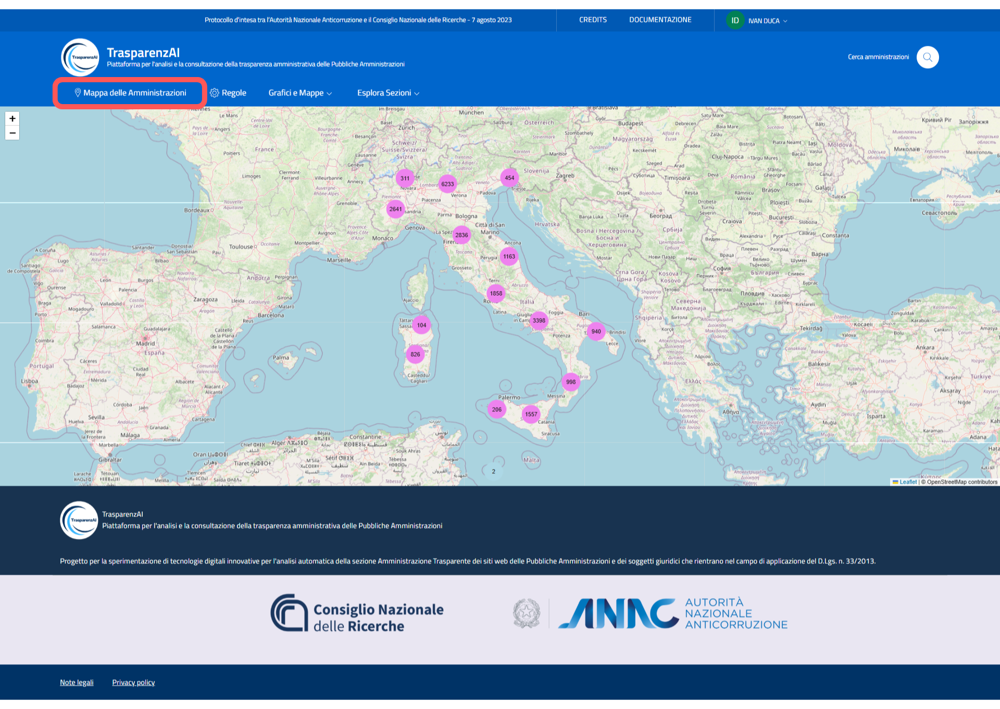
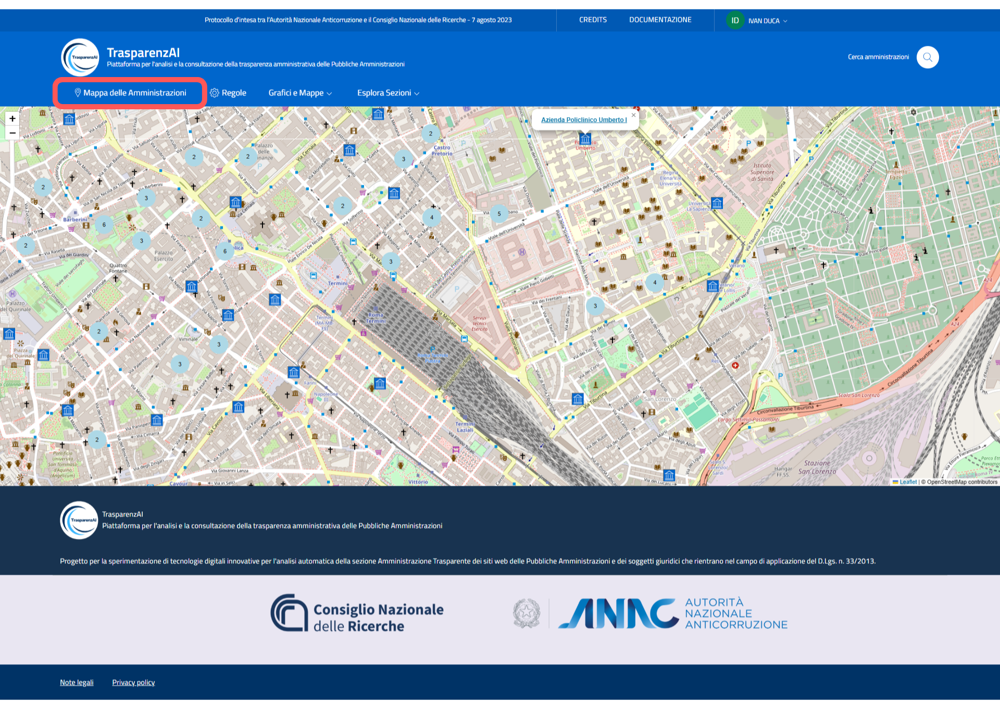

Menù "Mappa delle Amministrazioni"
==================================

Il menù "Mappa delle Amministrazioni" offre una visualizzazione geografica interattiva dei risultati ottenuti. L'utente può consultare grafici a torta che sintetizzano la conformità delle sezioni “Amministrazione Trasparente” per macro-aree. Zoomando sulla mappa, è possibile arrivare fino al dettaglio delle singole amministrazioni, visualizzando informazioni puntuali sulla conformità normativa di ciascun Ente.

.. _mappa_amministrazioni-img:

  Menù "Mappa delle Amministrazioni" - immagine generale

Attraverso la sezione “Mappa delle Amministrazioni”, l’utente accede a una rappresentazione geospaziale delle PA. Ogni area geografica è rappresentata da un grafico a torta che sintetizza il livello di conformità degli enti pubblici locali. Cliccando sulle aree, è possibile visualizzare i risultati per provincia e comune.
Il sistema consente uno zoom progressivo che, da macro-cluster regionali, permette di arrivare fino al dettaglio delle singole amministrazioni, con accesso diretto alla scheda di ciascun ente e alle sue informazioni specifiche.

.. _mappa_amministrazioni_zoom-1-img:
.. figure:: images/ui_mappa_amministrazioni_zoom-1.png
  :width: 800
  :alt: Menù - Mappa delle Amministrazioni zoom 1

  Menù "Mappa delle Amministrazioni" - zoom 1

.. _mappa_amministrazioni_zoom-2-img:

  Menù "Mappa delle Amministrazioni" - zoom 2
