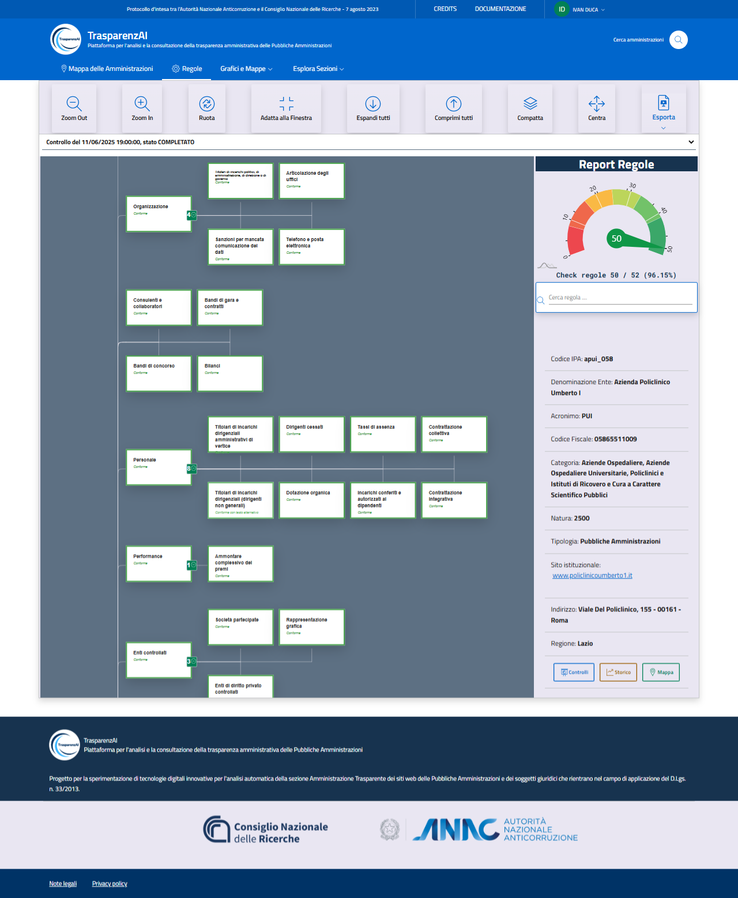

Menù "Mappa delle Amministrazioni"
==================================

Il menù "Mappa delle Amministrazioni" (:numref:`mappa_amministrazioni-img`) accede alla funzione di visualizzazione geografica e ricerca interattiva delle Amministrazioni. L'utente può individuare l'Amministrazione che intende visualizzare attraverso la navigazione della mappa geografica o attivando la rilevazione della geolocalizzazione del dispositivo. Nel caso di attivazione della geolocalizzazione, la piattaforma visualizza le Amministrazioni presenti nell'area in cui è posizionato l'utente (si precisa che le coordinate geografiche di posizione sono gestite dal dispotivo utente e non vengono acquisite dalla piattaforma).
La piattaforma viualizza le informazioni generali dell'Amministrazione selezionata, le relative sezioni della trasparenza amministrativa pubblicate sul sito web e le statistiche dei dati rilevati. 

.. _mappa_amministrazioni-img:
.. figure:: images/ui-mappa_amministrazioni.png
  :width: 800
  :alt: Menù - Mappa delle Amministrazioni

  Menù "Mappa delle Amministrazioni" - immagine generale

Utilizzando la funzione di "zoom" disponibile sul dispositivo utente (touch screen per i sistemi mobile e tablet, oppure la rotellina del mouse per i PC) è possibile ingrandire e ridurre la mappa (:numref:`mappa_amministrazioni_zoom-1-img`) fino al dettaglio della singola Amministrazione (:numref:`mappa_amministrazioni_zoom-2-img`), visualizzarne le informazioni e consultare i dati pubblicati della trasparenza amministrativa (:numref:`mappa_amministrazioni_selezione-img`).

.. _mappa_amministrazioni_zoom-1-img:
.. figure:: images/ui-mappa_amministrazioni_zoom-1.png
  :width: 800
  :alt: Menù - Mappa delle Amministrazioni zoom 1

  Menù "Mappa delle Amministrazioni" - zoom 1

.. _mappa_amministrazioni_zoom-2-img:
.. figure:: images/ui-mappa_amministrazioni_zoom-2.png
  :width: 800
  :alt: Menu - Mappa delle Amministrazioni zoom 2

  Menù "Mappa delle Amministrazioni" - zoom 2

.. _mappa_amministrazioni_selezione-img:

  Menù - Mappa delle Amministrazioni (dati Amministrazione selezionata)
