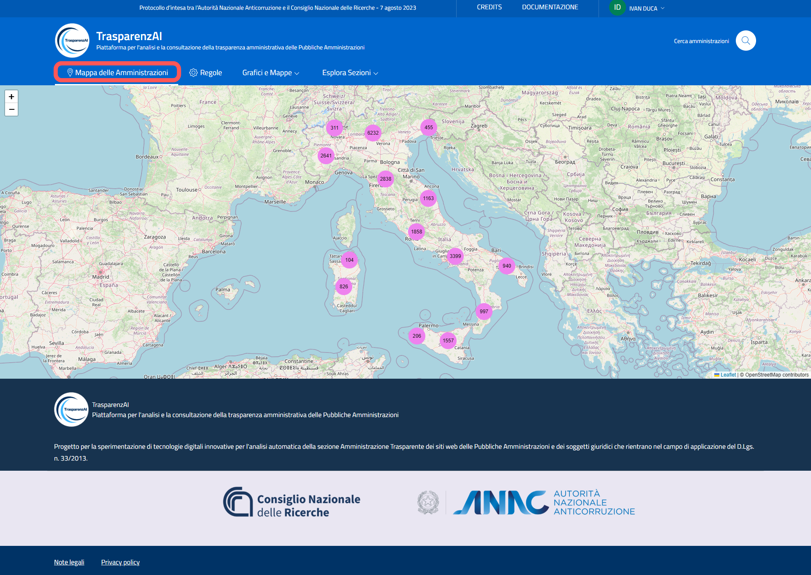
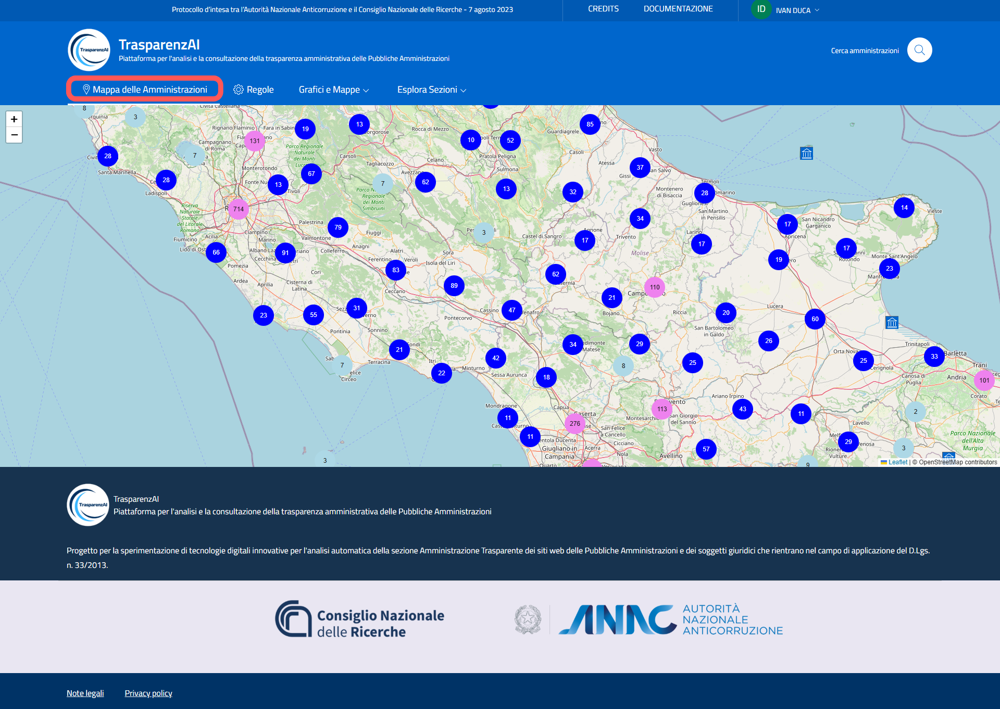
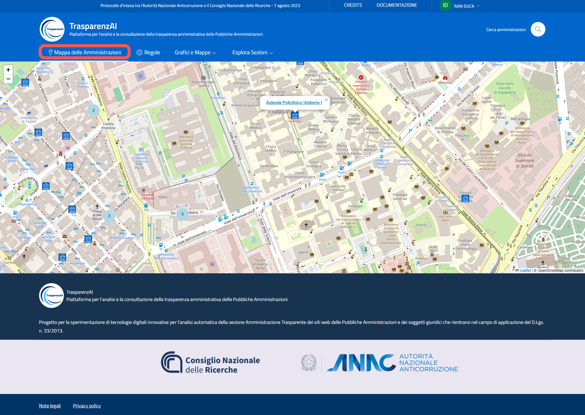

Menù "Mappa delle Amministrazioni"
==================================

Il menù "Mappa delle Amministrazioni" accede alla funzione di visualizzazione geografica interattiva deelle Amministrazioni (:numref:`ui-mappa_amministrazioni-img`). L'utente può così individuare l'Amministrazione che intende visualizzare. I sistema resituisce la informazioni generali dell'Amministrazione, le sezioni relative alla trasparenza pubblicate sul sito web e le statistiche relative allo stato dei dati rilevati. Se l'utente lo permette, il sistema permette di individuare le Amministrazioni presenti nell'area dell'utente attraverso un meccanismo di geolocalizzazione locale (l'applicazione richiede l'autorizzazione all'utente per rilevare le coordinate geografiche di posizione che rimangono esclusivamente sul dispotivo utente e non vengono acquisite dalla piattaforma).

.. _mappa_amministrazioni-img:

  Menù "Mappa delle Amministrazioni" - immagine generale

Zoomando sulla mappa (:numref:`ui-mappa_amministrazioni_zoom-1-img`), è possibile arrivare fino al dettaglio delle singole amministrazioni (:numref:`ui-mappa_amministrazioni_zoom-2-img`), visualizzando informazioni puntuali sulla conformità normativa di ciascun Ente.

.. _mappa_amministrazioni_zoom-1-img:

  Menù "Mappa delle Amministrazioni" - zoom 1

.. _mappa_amministrazioni_zoom-2-img:

  Menù "Mappa delle Amministrazioni" - zoom 2
