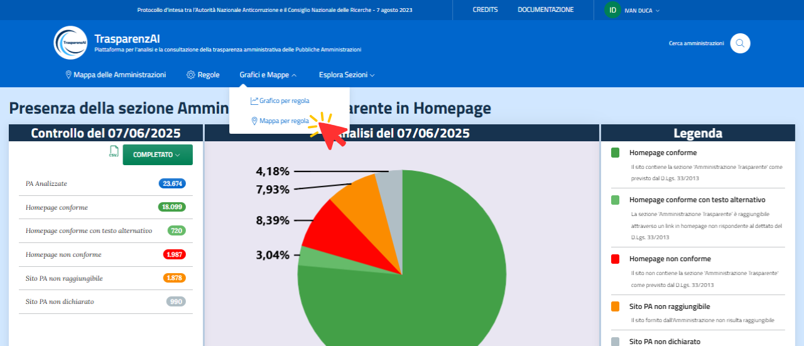
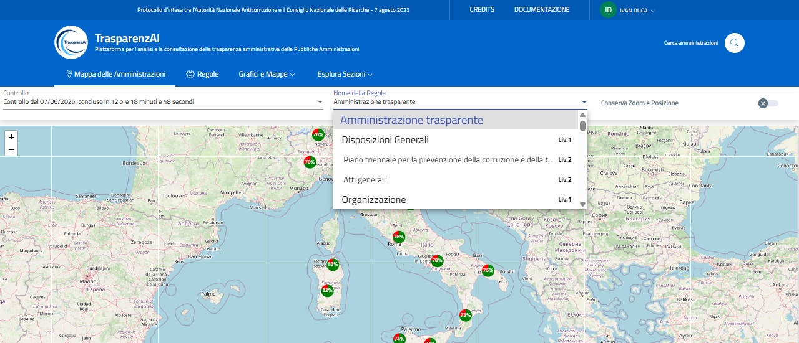
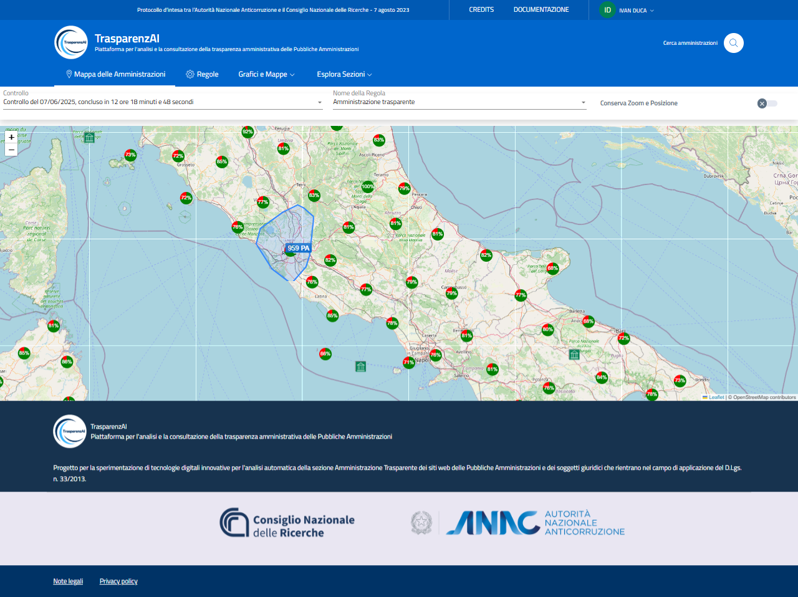
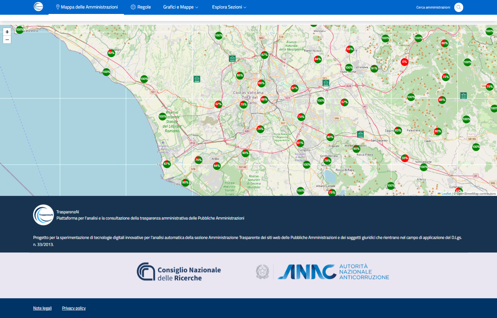
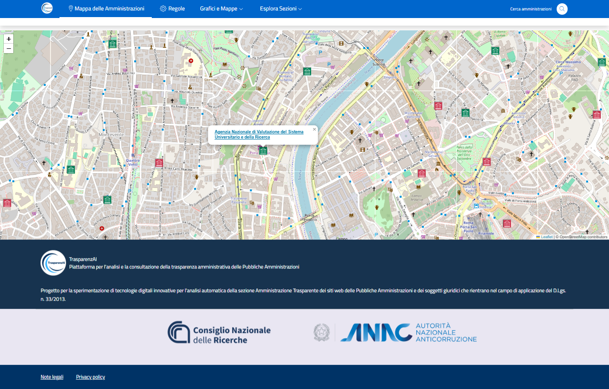

Menù "Mappa per regola" ("Grafici e Mappe")
==============================================

La voce di menù "Grafico per regola" permette di accedere alla rappresentazione grafica geolocalizzata dei risultati generati da ogni scansione. Il menù a tendina "Nome della Regola" permette di selezionare la sezione dell'albero Amministrazione Trasparente di cui si vuole mostrare una lo stato su scala geografica.
Attraverso la funzione di zoom è possibile definire la dimensione spaziale da visualizzare ed i relativi dati aggregati per area. La funzione di zoom permette di arrivare fino alla singola amministrazione per visualizzarne i risultati della scansione.

.. _mappa-per-regola-menu-img:

  Menù "Mappa per regola"

La figura di seguito mostra uno zoom relativo alle macro-area italiane. I grafici sono riferiti alla scansione effettuata il 07/06/2025 per la sezione principale Amministrazione Trasparente.

.. _mappa-per-regola-zoom-1-img:
.. figure:: images/ui-mappa_per_regola_zoom-1.png
  :width: 800
  :alt: Menù "Mappa per regola" - Grafici per macro aree zoom 1

  Menù "Mappa per regola" - Grafici per macro aree zoom 1

Il menù a tendina «Nome della Regola» permette la selezione dei dati di scansione relativi alle varie sezioni dell’albero delle regole.

.. _mappa-per-regola-selezione-regola-img:

  Menù Menù "Mappa per regola" - selezione "Nome della Regola"

Le seguenti 3 figure mostrano visualizzazioni della sezione principale Amministrazione Trasparente con livelli di zoom differenti.

.. _mappa-per-regola-zoom-2-img:

  Menù "Mappa per regola" - Grafici per macro aree zoom 2

.. _mappa-per-regola-zoom-3-img:

  Menù "Mappa per regola" - Grafici per macro aree zoom 3

La figura di sotto mostra il livello di zoom massimo con identificazione della singola Amministrazione (esempio: Agenzia Nazionale di Valutazione del Sistema Universitario e della Ricerca). Cliccando sulla denominazione dell'Amministrazione è possibile accedere alla funzione di analisi delle singole regole, per la verifica di tutte le sezioni Amministrazione Trasparente. Per ogni sezione è fornito il link di accesso diretto alle relative pagine informative.

.. _mappa-per-regola-zoom-4-img:

  Menù "Mappa per regola" - singola Amministrazione
