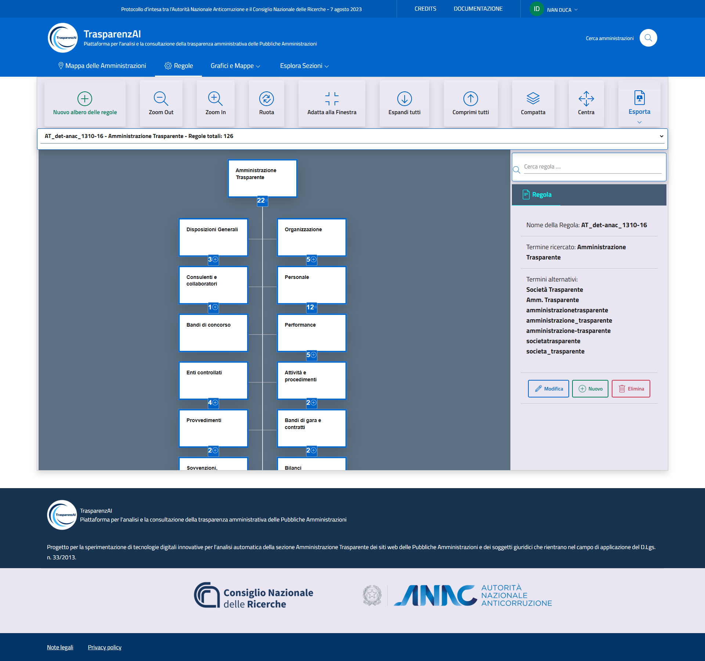
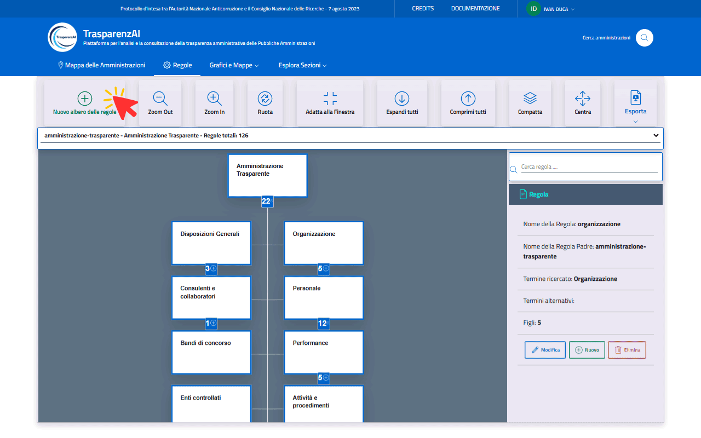
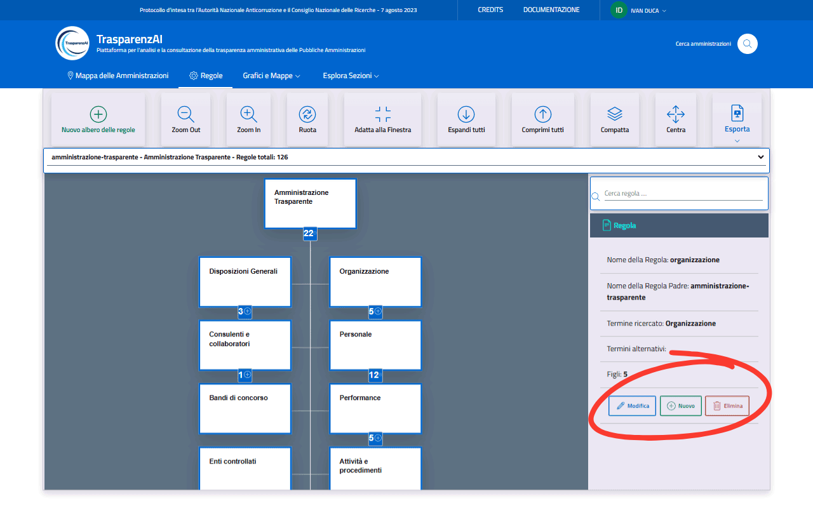

Menù "Regole"
=============

Il menù "Regole" (:numref:`menu-regole-img`) attiva le funzioni relative alla gestione degli alberi delle regole che consente agli utenti di visualizzare e interagire direttamente con la struttura degli alberi di regole da verificare. Gli alberi delle regole sono navigabili tramite comandi intuitivi quali zoom, rotazione e adattamento alla finestra.

.. _menu-regole-img:

  Menù "Regole"

L'utente con ruolo "Amministratore" può effettuare operazioni per la creazione di nuovi alberi delle regole (:numref:`menu-regole-nuovo.albero-regole-img`), la gestione di alberi di regole già predisposti (:numref:`menu-regole-alberi-alternativi-img`), l'eliminazioni di nodi o dell'intero albero (:numref:`menu-regole-modifica-nuovo-elimina-img`).

.. _menu-regole-alberi-alternativi-img:
.. figure:: images/ui-regole_alberi_alternativi.png
  :width: 800
  :alt: Selezione albero delle regole per scansione

  Selezione albero delle regole per scansione

Il tasto "Nuovo albero delle regole" (:numref:`menu-regole-nuovo.albero-regole-img`) permette di creare nuovi alberi delle regole da applicare a scansioni generali o controlli specifici per singola Amministrazioni o classi di Amministrazioni.

.. _menu-regole-nuovo-albero-delle-regole-img:

  Creazione di un nuovo albero delle regole

Per ogni elemento dell'albero selezionato, sono presenti i tasti "Modifica", "Nuovo" ed "Elimina" (:numref:`menu-regole-modifica-nuovo-elimina-img`).
Il tasto "Modifica" permette di modificare i termini da ricercare per ogni regola, definendo un elenco di termini che la piattaforma deve considerare equivalenti al termine ricercato nel corso delle scansioni (esempio termine ricercato "Amministrazione Trasparente", termini alternativi "Società Trasparente", "Amm. Trasparente"). Tale funzionalità, aumenta la tolleranza della piattaforma nell'individuazione dei termini da ricercare e permette controlli con gradi di libertà configurabili, adattando la ricerca alla terminologia effettivamente utilizzata nei siti delle Amministrazioni.
Il tasto "Nuovo" attiva la funzione di creazione di una nuova regola-figlia della regola attuale (sotto-sezione).
Il tasto "Elimina" cancella definitivamente la regola selezionata.

.. _menu-regole-modifica-nuovo-elimina-img:

  Tasti per la modifica, la creazione e l'eliminazione di una regola
