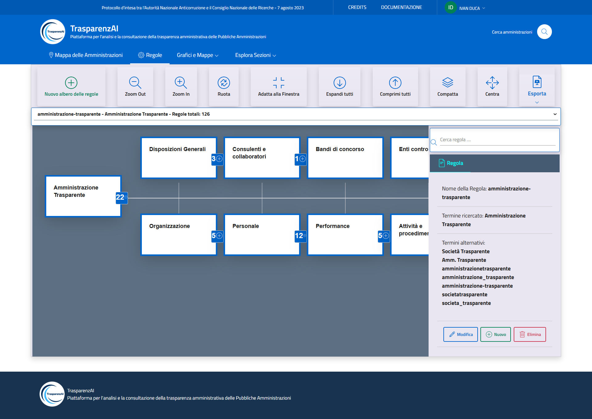
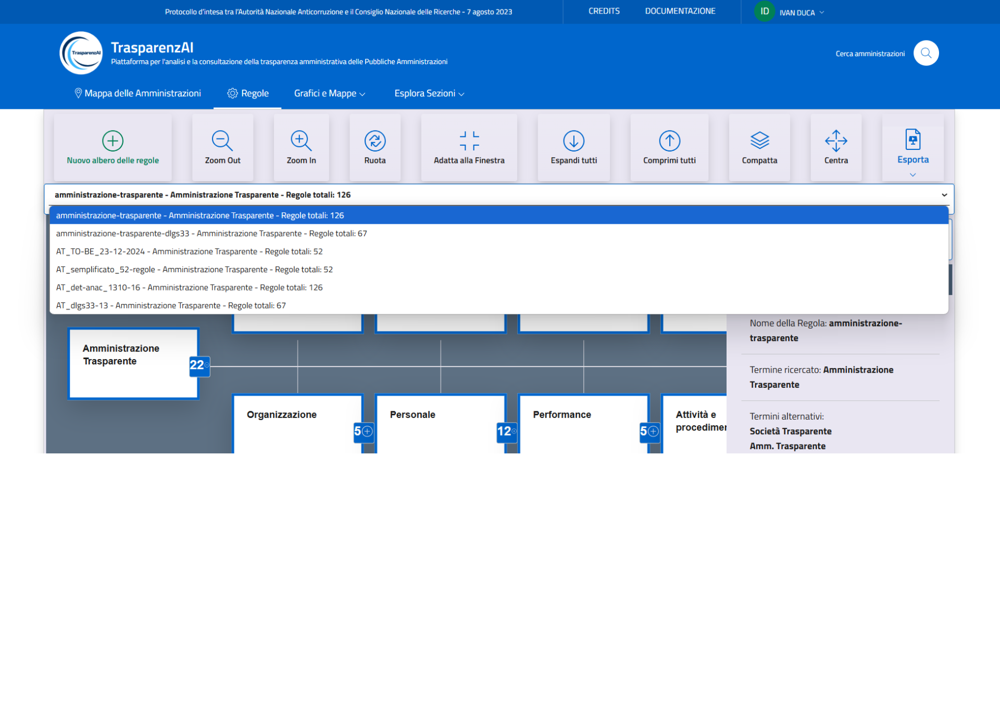

Menù "Regole"
=============

La sezione dedicata agli alberi delle regole consente agli utenti di visualizzare e interagire direttamente con la struttura normativa prevista da ANAC. Gli alberi delle regole sono navigabili tramite comandi intuitivi quali zoom, rotazione e adattamento alla finestra. L’interfaccia grafica indica chiaramente la possibilità di creare nuovi alberi delle regole per specifiche condizioni, modificare o eliminare quelli già esistenti. Pertanto, sarà possibile effettuare scansioni (controlli) applicando specifici alberi delle regole preventivamente creati.

.. _home-img:

  Menù "Regole"

Il sistema consente di selezionare tra diversi alberi di regole già predisposti o di costruirne di nuovi. È inoltre possibile modificare l’elenco dei termini che devono essere riconosciuti come equivalenti a “Amministrazione Trasparente”, adattando così i controlli alla varietà delle denominazioni effettivamente utilizzate nei siti delle Amministrazioni.

.. _home-img:

  Selezione albero delle regole per scansione
