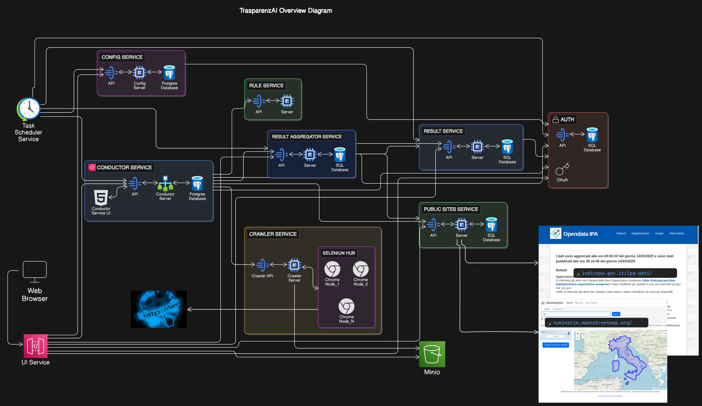

Architettura della soluzione
============================

La piattaforma è composta da molti componenti, integrati in una architettura a
microservizi, comunicanti tramite il paradigma REST.
Ogni microservizio è realizzato con framework opensource e rilasciato a sua
volta come software opensource. 
Anche tutti i componenti infrastrutturali utilizzati nella piattaforma sono 
opensource, azzerando i costi di licenza e permettendo una totale riusabilità
di questa piattaforma per scopi uguali o analoghi a quelli per cui è stata
pensata.

È previsto un accesso differenziato alle funzionalità della piattaforma, 
tramite un sistema di autenticazione e autorizzazione basato sul protocollo
OAuth2 e dei ruoli predefiniti inseriti nel token JWT.

Sia l'interfaccia WEB, realizzata dal componente *UI Service*, che ogni API
REST, è integrata quindi con un IDP OAuth2.
IL servizio in staging realizzato per ANAC utilizza
`Keycloak <https://www.keycloak.org>`_ come IDP OAuth2.

Il grafico in :numref:`overview-diagram-img` sottostante riassume i componenti principali del sistema.

.. _overview-diagram-img:

  TrasparenzAI - Overview Diagram

*Rispetto a una tipica architettura a microservizi è stato scelto di non
introdurre al momento un API Gateway e un Service Discovery, in quanto 
la sua adozione potrebbe dipendere dalle politiche di deploy della soluzione.
In particolare qualora si decida di usare Kubernetes potrebbe essere indicato
utilizzare i meccanismi di API Gateway e Service Discovery disponibili nel
coordinatore dei container.*

Scansione dei siti delle PA
---------------------------

La fase di scansione dei siti delle PA viene coordinata dal servizio
*Conductor Service*. Questo servizio è basato sul componente opensouce 
`Conductor <https://github.com/Netflix/conductor>`_ realizzato da Netflix.

La definizione dei workflow e dei task necessari per compiere tutte le
operazioni di analisi, verifica e salvataggio dei risultati delle scansioni
dei siti delle PA è definita tramite alcuni file JSON.
Questo garantisce una facile configurabilità e adattabilità di questa soluzione
a evoluzioni di questa piattaforma oppure a problematiche di crawling e analisi
di natura diversa da quella di questo progetto.

L'avvio della fase di scansione di tutti i siti delle PA viene avviata dal
microservizio *Task Scheduler Service*, il quale invoca via REST il 
*Conductor Service* con una cadenza configurabile (per esempio 3 o 4 volte la
settimana).

La lista dei siti delle PA è prelevata dal microservizio *Public Site Service*,
mentre i risultati delle validazioni sono inseriti sia nel microservizio 
*Result Service* che nel servizio *Result Aggregator Service*.
Inoltre le screenshot delle pagine HTML ritenute problematiche dal sistema 
vengono archiviate in uno storage *S3 like*, in particolare nel servizio fornito
in staging ad ANAC viene utilizzato il prodotto Opensource 
`Minio <https://min.io/>`_.

Le regole applicate per la verifica della corrispondenza del sito con la legge
sulla trasparenza sono definite tramite il servizio *Rule Service*. 
Quest'ultimo è stato realizzato in modo da essere un servizio generico 
di applicazioni di regole di parsing e configurabile tramite file JSON.

Per l'attività di crawling e di rendering delle pagine HTML da
analizzare, la soluzione prevede l'utilizzo di un proprio crawler per prelevare lo
streaming html delle pagine da analizzare e l'adozione di un 
`Selenium Hub <https://www.selenium.dev/documentation/grid/>`_ per distrubuire
su più istanze di Google Chrome il rendering delle pagine HTML che contengono
codice javascript da interpretare.
