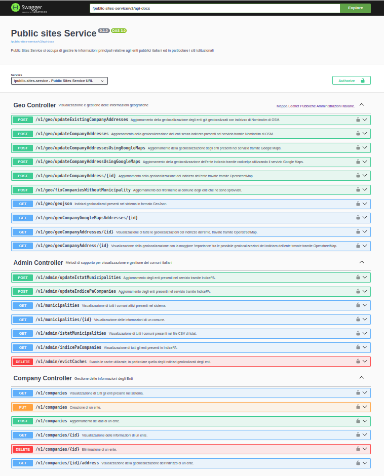
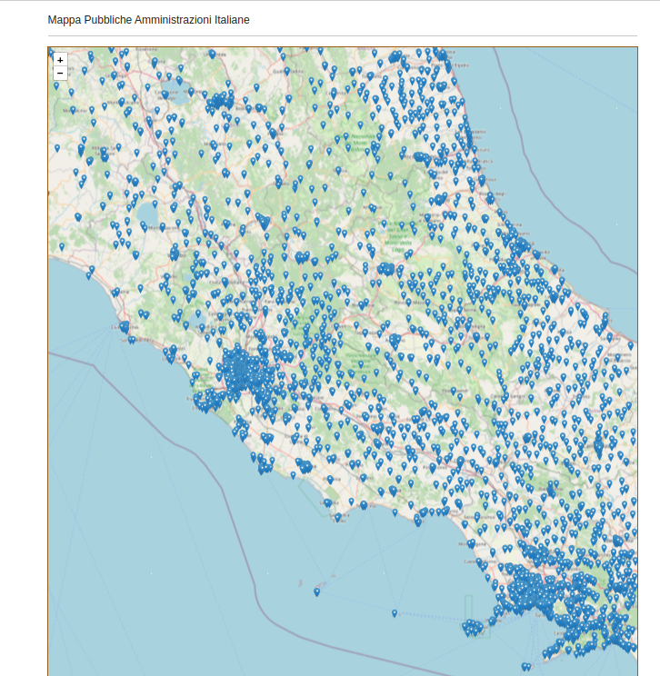

Public Sites Service
====================

Public Sites Service è il componente che si occupa di gestire le informazioni
principali relative agli enti pubblici italiani ed in particolare i siti
istituzionali.

Public Sites Service mantiene nel proprio datastore locale le informazioni 
egli enti che possono essere inserite/aggiornate tramite gli OpenData di 
IndicePA, oppure inserite tramite appositi servizi endopoint REST.

L'idea è quella di avere una fonte facile da consultare e estendibile delle
informazioni delle organizzazioni pubbliche da analizzare. In particolare
sono trattate automaticamente le info utili derivanti IndicePA ma è possibile
inserire altri enti da sottoporre a analisi, inserendoli via REST in questo
servizio oppure integrando altre fonti esterne sincronizzate automaticamente.

Public Sites Service fornisce alcuni servizi REST utilizzabili in produzione 
per:

 * mostrare la lista degli enti presenti negli OpenData di IndicePA
 * inserire ed aggiornare all'interno del servizio le informazioni degli Enti
   tramite gli OpenData di IndicePA 
 * geolocalizzare gli Enti italiani tramite il servizio Nominatim di 
   OpenStreetMap
 * visualizzare i dati di un Ente
 * mostrare la lista paginata degli Enti presenti nel servizio, con possibilità
   di filtrarli per codiceCategoria, codiceFiscaleEnte, codiceIpa, 
   denominazioneEnte
 * inserire, aggiornare e cancellare le informazioni degli Enti all'interno del
   servizio (direttamente senza passare da IndicePA)

Il servizio sincronizza e rendere disponibili via REST anche le informazioni 
dei comuni italiani, prelevendo ogni notte il CSV dal sito dell'ISTAT dei comuni
e aggiornando questo info dentro il servizio stesso. Le info dei comuni servono
anche per effettuare una geolocalizzazione più precisa degli enti, che su 
IndicePA sono classificati solamente tramite il codice catastale del comune.

L'aggiornamento dei dati locali al servizio Public Sites Service tramite
IndicePA avviene ogni mattina alle 6:30.
L'aggiornamento dei dati locali al servizio Public Sites Service tramite il CSV
di ISTAT avviene ogni mattina alle 6:40.

Il codice sorgente di questo componente è disponibile su GitHub:
 - https://github.com/cnr-anac/public-sites-service

OpenAPI e Swagger UI
--------------------

Una volta avviato il servizio i servizi REST sono documentati tramite OpenAPI 
e consultabili all'indirizzo /swagger-ui/index.html.

L'OpenAPI del servizio di staging è disponibile all'indirizzo 
https://dica33.ba.cnr.it/public-sites-service/swagger-ui/index.html.

Mappa delle PA Italiane
-----------------------

Il servizio contiene anche una mappa geografica delle PA italiane realizzata
tramite leaflet.

Sicurezza
---------

Gli endpoint REST di questo servizio sono protetti tramite autenticazione OAuth
con Bearer Token.
E' necessario configurare l'idp da utilizzare per validare i token OAuth tramite
le due proprietà mostrate nell'esempio seguente::

  - spring.security.oauth2.resourceserver.jwt.issuer-uri=https://dica33.ba.cnr.it/keycloak/realms/trasparenzai
  - spring.security.oauth2.resourceserver.jwt.jwk-set-uri=https://dica33.ba.cnr.it/keycloak/realms/trasparenzai/protocol/openid-connect/certs

Per l'accesso in HTTP GET all'API è sufficiente essere autenticati, per gli 
endpoint accessibili con PUT/POST/DELETE è necessario oltre che essere autenticati
che il token OAuth contenga un role ADMIN o SUPERUSER.
