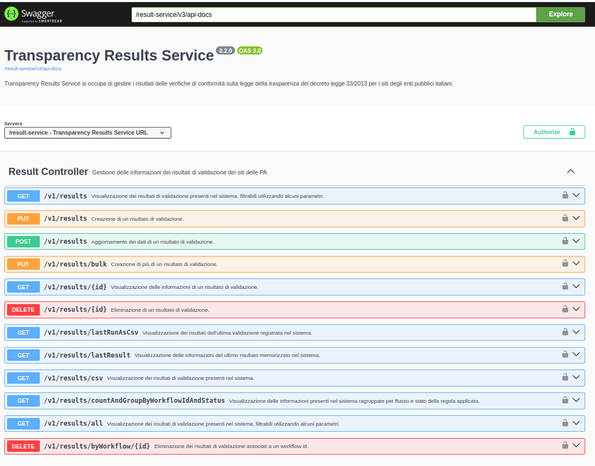

Result Service
==============

Result Service è il componente che si occupa di gestire i risultati delle
verifiche sulla corrispondenza dei siti degli enti pubblici italiani in
relazione al decreto legge 33/2013 sulla transparenza.

Result Service fornisce alcuni servizi REST utilizzabili in produzione per:

 - inserire, aggiornare e cancellare all'interno del servizio le informazioni
   di una verifica effettuata su un sito web di una PA
 - visualizzare i dati di una verifica su un sito web
 - mostrare la lista delle verifiche effettuate
 - esportare in CSV i risultati delle validazioni presenti

Il codice sorgente di questo componente è disponibile su GitHub:
 - https://github.com/cnr-anac/result-service

OpenAPI e Swagger UI
--------------------

Una volta avviato il servizio i servizi REST sono documentati tramite OpenAPI 
e consultabili all'indirizzo /swagger-ui/index.html.

L'OpenAPI del servizio di staging è disponibile all'indirizzo 
https://dica33.ba.cnr.it/result-service/swagger-ui/index.html.

Sicurezza
--------------

Gli endpoint REST di questo servizio sono protetti tramite autenticazione OAuth
con Bearer Token.
E' necessario configurare l'idp da utilizzare per validare i token OAuth tramite
le due proprietà mostrare nell'esempio seguente::

  - spring.security.oauth2.resourceserver.jwt.issuer-uri=https://dica33.ba.cnr.it/keycloak/realms/trasparenzai
  - spring.security.oauth2.resourceserver.jwt.jwk-set-uri=https://dica33.ba.cnr.it/keycloak/realms/trasparenzai/protocol/openid-connect/certs

Per l'accesso in HTTP GET all'API è sufficiente essere autenticati, per gli
endpoint accessibili con PUT/POST/DELETE è necessario oltre che essere autenticati
che il token OAuth contenga un role ADMIN o SUPERUSER.