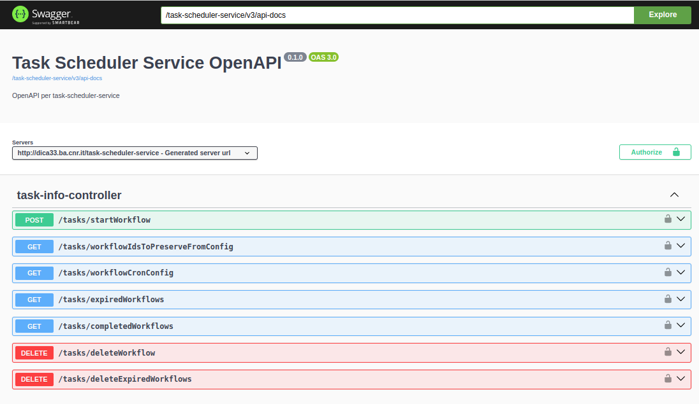

Task Scheduler Service
=======================

Task Scheduler Service è il componente che si occupa di avviare alcuni processi
eseguiti a intervalli fissi, come per esempio l'**avvio delle scansioni** dei siti 
del PA per la verifica della corrispondenza dei requisiti e la **cancellazione
dei risultati di scansione più vecchi**.

Nell'utilizzo tramite **docker-compose.yml** ricordarsi di impostare nel **.env**
la corretta variabile d'ambiente che specifica l'url del config-service da
utilizzare e la password per l'autenticazione Basic Auth con il
*config-service*::

  environment:
    - confighost=${CONFIG_HOST}
    - spring.security.oauth2.client.registration.oidc.client-secret=${OIDC_CLIENT_SECRET}

Le informazioni di configurazione dei cron relativi ai workflow possono essere
visualizzate all'url **/tasks/workflowCronConfig**.

Il codice sorgente di questo componente è disponibile su GitHub:
 - https://github.com/cnr-anac/task-scheduler-service

OpenAPI e Swagger UI
--------------------

Una volta avviato il servizio i servizi REST sono documentati tramite OpenAPI 
e consultabili all'indirizzo /swagger-ui/index.html.

L'OpenAPI del servizio di staging è disponibile all'indirizzo 
https://dica33.ba.cnr.it/task-scheduler-service/swagger-ui/index.html.

Dipendenze e configurazione
---------------------------

Questo servizio ha quattro dipendenze per funzionare:

  * il `Config Service <https://github.com/cnr-anac/config-service>`_ 
    da cui prelevare i parametri per l'avvio dei nuovi flussi e la
    configurazione con le policy di cancellazione dei vecchi risultati
  * il `Conductor Service <https://github.com/cnr-anac/conductor>`_ per avviare 
    nuovi flussi di scansioni dei siti, per prelevare la lista dei flussi terminati e
    per cancellare dal Conductor i flussi più vecchi
  * il `Result Service <https://github.com/cnr-anac/result-service>`_ per 
    cancellare i risultati di validazione più vecchi
  * il `Result Aggregator Service <https://github.com/cnr-anac/result-aggregator-service>`_ 
    per cancellare i risultati di validazione aggregati più vecchi

L'indirizzo di questi servizi è da configurabile nel file 
`application.properties <https://github.com/cnr-anac/task-scheduler-service/blob/main/src/main/resources/application.properties>`_
oppure tramite variabili d'ambiente se avviato tramite Docker.