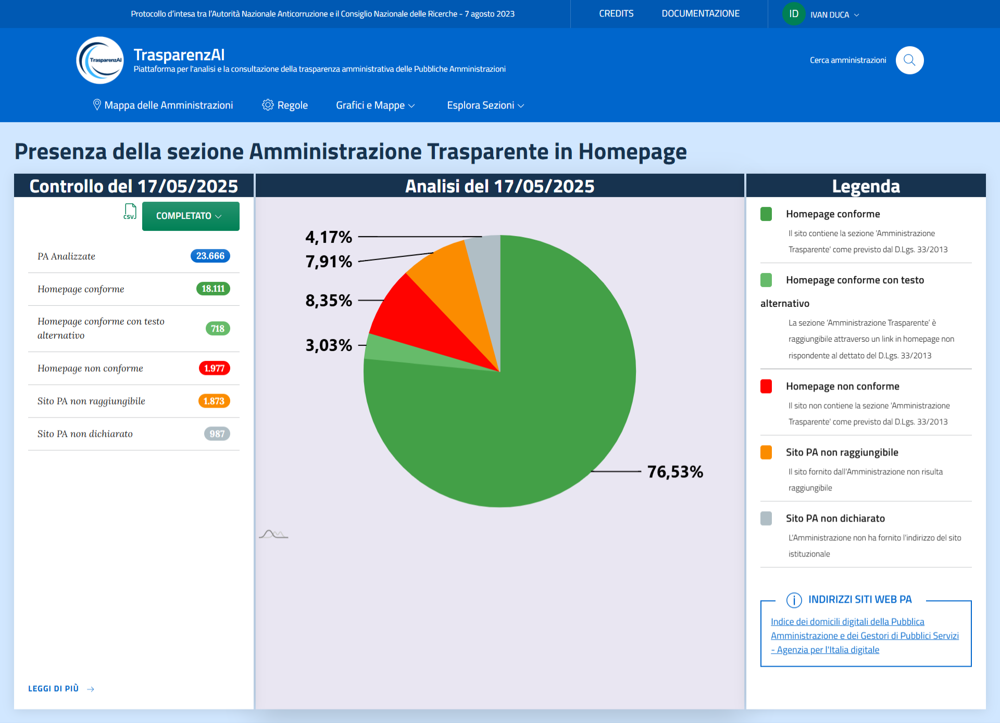
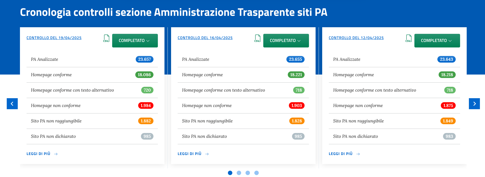
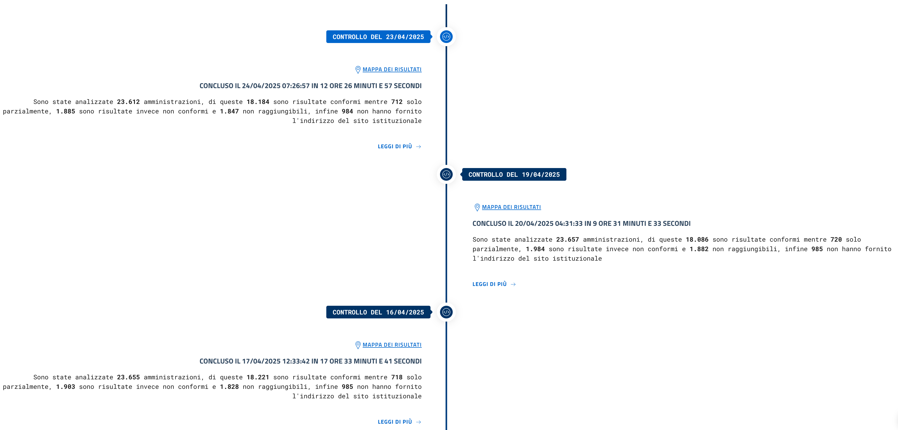

UI service
=================

UI Service integra e mostra i dati presenti nei vari servizi fornendo la possibilità, avendo gli
opportuni permessi, di attivare le funzionalità preposte all'inserimento e alla cancellazione degli stessi,
inoltre è possibile attivare l'autenticazione su tutte le pagine, o in alternativa di accedere senza
autenticazione per la sola consultazione dei dati, per poi richiederla successivamente.

L'interfaccia web è progettata seguendo le linee guida dell’**accessibilità**, della **responsività** e
del **design istituzionale**, secondo quanto previsto da `Designers Italia <https://designers.italia.it/>`__.
L’aspetto è professionale, ordinato e coerente con la comunicazione della Pubblica Amministrazione.

.. _home-img:
.. figure:: https://raw.githubusercontent.com/trasparenzai/ui-service/refs/heads/main/home.png
  :width: 800
  :alt: Home Page

  Home Page - Interfaccia Web

Header (Intestazione)
---------------------
#. Presenta la barra superiore istituzionale con il riferimento al `Protocollo d’intesa tra l’Autorità Nazionale Anticorruzione e il Consiglio Nazionale delle Ricerche del 7 agosto 2023 <https://www.anticorruzione.it/-/protocollo-d-intesa-tra-l-autorit%C3%A0-nazionale-anticorruzione-e-il-consiglio-nazionale-delle-ricerche-7-agosto-2023>`__, e al menu di accesso rapido (login, lingua, credits).
#. Sezione contenete il logo, con il nome e la descrizione del servizio e il link alla ricerca delle amministrazioni
#. Il menu di navigazione principale è responsive e può essere collassato su dispositivi mobili,
   presenta le seguenti voci:

.. hlist::
    :columns: 4

    * Mappa delle Amministrazioni
    * Regole
    * Grafici e Mappe
    * Esplora Sezioni

Homepage
--------
La homepage della piattaforma TrasparenzAI è stata progettata per garantire immediatezza e semplicità nella consultazione dei risultati ottenuti. L'interfaccia mostra chiaramente i dati relativi all’ultima scansione effettuata, fornendo un quadro sintetico del numero di pubbliche amministrazioni analizzate e della conformità riscontrata. È possibile visualizzare la cronologia dettagliata dei controlli precedenti, ciascuno accompagnato da un report scaricabile in formato CSV, e una timeline interattiva che permette di consultare rapidamente l’evoluzione dei controlli nel tempo.

Sezione ultimo controllo / contenuti principali
-----------------------------------------------
Layout a griglia con card che illustrano i principali dati dell'ultimo controllo eseguito.

La prima card illustra i dati ragruppati per stato, la card centrale invece
mostra una torta con le percentuali degli stati la cui legenda è esplicitata nell'ultima card a destra.

.. _home-last_scan-img:

  Home Page - Ultima scansione

Sezione cronologia dei controlli
-----------------------------------------------
La piattaforma offre un riepilogo visivo delle scansioni precedenti, ciascuna con dati sintetici e la possibilità di esportare i risultati.
La sezione è composta da un carousel che permette di scorrere la cronologia dei controlli memorizzati dal sistema. Le informazioni includono data e ora del controllo, numero di amministrazioni analizzate, conformità rilevate. Qualora si abbia il ruolo necessario, è possibile l'esportazione in formato *csv* dei dati.
Il link "LEGGI DI PIU' ->" mostra la distribuzione geografica dei dati del singolo controllo.

.. _home-carousel-img:

  Home Page - Carousel

Sezione timeline
-----------------------------------------------
La sezione in homepage presenta una timeline verticale delle scansioni effettuate con il riepilogo dei risultati ottenuti. Ogni nodo nella linea del tempo consente di consultare nel dettaglio i dati della relativa scansione, fornendo una visione cronologica dell’attività di monitoraggio. Per ogni nodo è presente un link attivo alla distribuzione geografica dei dati del singolo controllo.

.. _home-timeline-img:

  Home Page - Timeline
