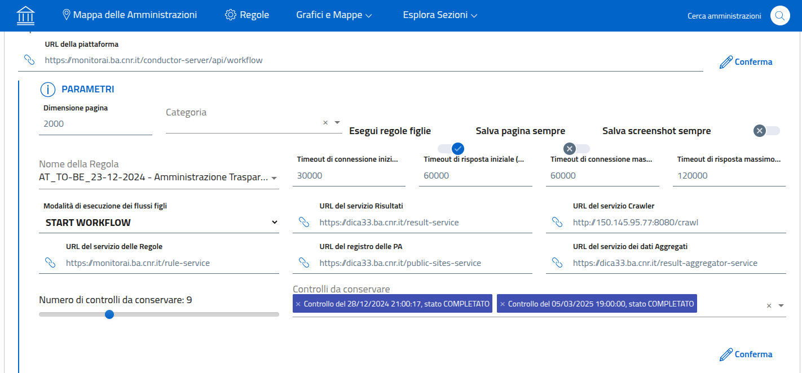
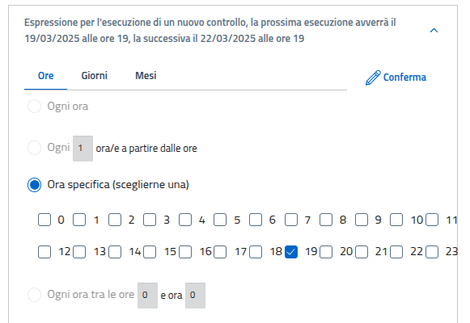

Config Service
==============

Config Service è il componente che si occupa di archiviare e distribuire alcune
informazioni di configurazione dei servizi che compongono lo stack del progetto
TrasparenzAI.

Config Service mantiene nel proprio datastore locale le configurazioni che sono
fornite agli altri microservizi.

Il codice sorgente è disponibile su github:
  - https://github.com/trasparenzai/config-service

Nel repository github è compreso anche un script per la prima installazione
del servizio `first-setup.sh <https://github.com/trasparenzai/config-service/blob/main/first-setup.sh>`_.

In particolare è necessario configurare la sezione della sicurezza.

Sicurezza
---------
L'accesso in lettura alla configurazione di tipo Spring Cloud Config
disponibile al path /config è protetto con autenticazione di tipo Basic Auth,
l'utente e la password possono essere indicati nel docker-compose.yml come
nell'esempio seguente::

  - spring.security.user.name=config-service-user
  - spring.security.user.password=PASSWORD_DA_IMPOSTARE_E_CONDIVIDERE_CON_I_CLIENT

Invece gli endpoint REST di questo servizio disponibili al path /properties
sono protetti tramite autenticazione OAuth con Bearer Token. 
È necessario configurare l'IDP da utilizzare per validare i token OAuth tramite
le due proprietà impostabili nel docker-compose.yml come nell'esempio seguente::

  - spring.security.oauth2.resourceserver.jwt.issuer-uri=https://dica33.ba.cnr.it/keycloak/realms/trasparenzai
  - spring.security.oauth2.resourceserver.jwt.jwk-set-uri=https://dica33.ba.cnr.it/keycloak/realms/trasparenzai/protocol/openid-connect/certs

I valori dei parametri *jwt.issuer-uri* e *jwk-set-uri* sono quelli già descritti
nella sezione :doc:`authentication`.

Configurazione di default
-------------------------

Il config-service viene fornito con una configurazione predefinita da
personalizzare secondo le proprie esigenze.

In particolare sono presenti alcune URL degli altri microservizi che è
necessario configurare secondo il proprio setup.

I dati di default possono essere modificati sia tramite l'API REST del
servizio che tramite l'interfaccia web (il componente UI Service).

Nell'esempio seguente viene mostrata la configurazione predefinita modificabile
direttamente tramite l'interfaccia web della piattaforma.

In particolare sono sicuramente da impostare:

  - URL del servizio Risultati
  - URL del servizio Crawler
  - URL del servizio delle Regole
  - URL del registro delle PA
  - URL del servizio dei dati Aggregati

Nel caso si voglia modificare le tempistiche e la frequenza delle scansioni
complete di tutte le PA è possibile utilizzare sempre l'interfaccia web.

