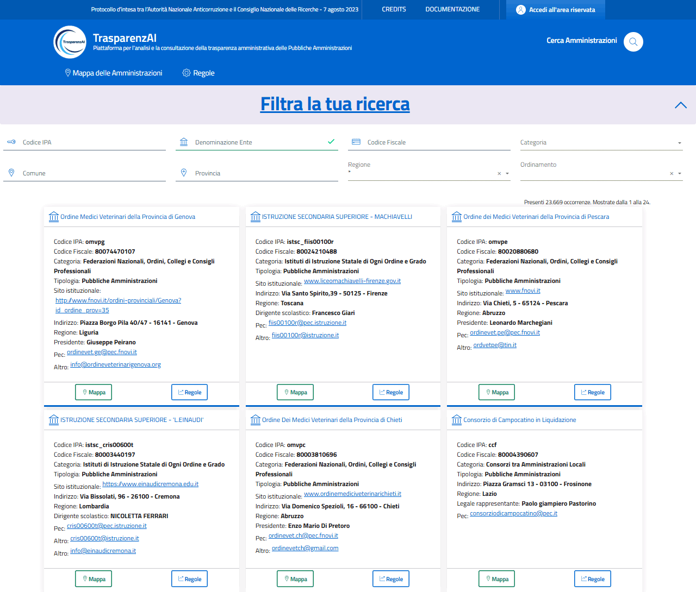
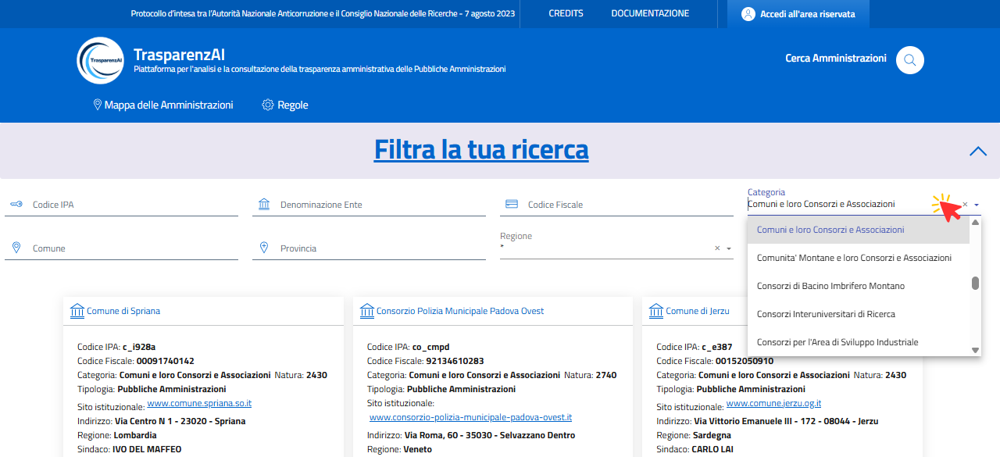
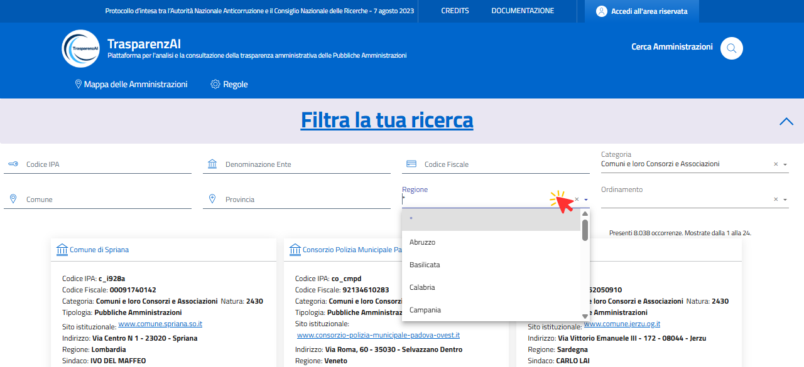
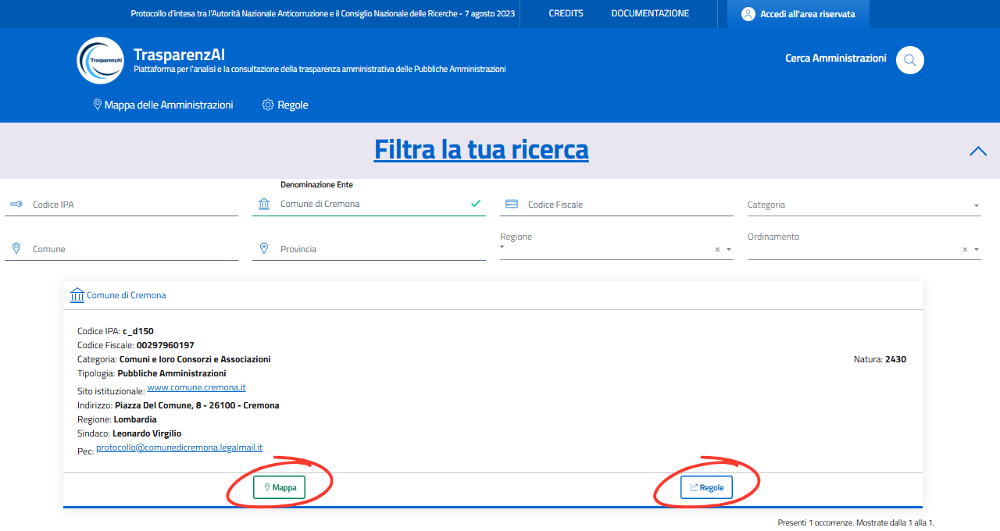
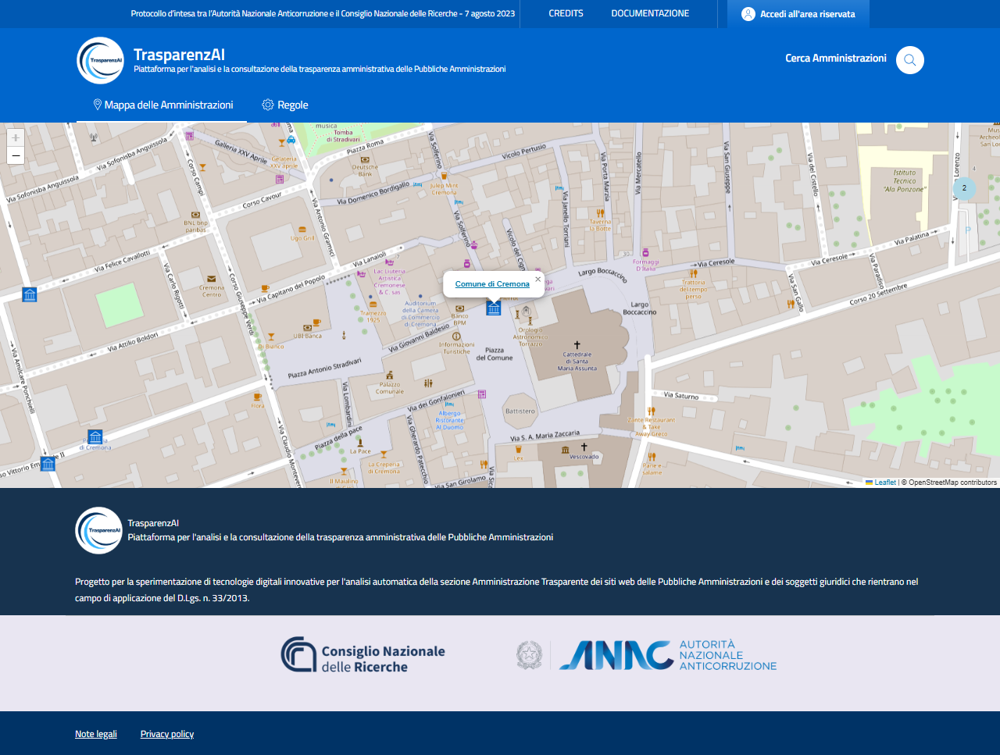

Menù Utente "Cerca Amministrazioni"
============================

La piattaforma dispone di una funzione di ricerca avanzata (:numref:`user-cerca_amministrazioni-img`) che permette di individuare specifiche pubbliche amministrazioni utilizzando filtri. Questa funzionalità semplifica significativamente l’individuazione dell'Amministrazione di cui si ricercano le informazioni di trasparenza amministrativa pubblicati.

.. _user-cerca_amministrazioni-img:

  Menù Utente - Cerca Amministrazioni

Sono disponibili molte possibilità di ricerca attraverso filtri - anche combinati - per Codice IPA, Denominazione Ente, Codice Fiscale, Categoria, Comune, Provincia, Regione e la selezione del criterio di ordinamento (:numref:`user-cerca_amministrazioni-categoria-img`, :numref:`user-cerca_amministrazioni-regione-img`).
  
.. _user-cerca_amministrazioni-categoria-img:

  Esempio ricerca filtro "Categoria"

.. _user-cerca_amministrazioni-regione-img:

  Esempio ricerca filtro combinato "Categoria e Regione"

I risultati della ricerca mostrano le informazioni generali dell'Amministrazione (:numref:`user-cerca_amministrazioni-esempio-1-1-img`) e i tasti "Regole" (:numref:`user-cerca_amministrazioni-esempio-1-2-img`) e "Mappe" (:numref:`user-cerca_amministrazioni-esempio-1-3-img`) permettono l'accesso diretto alle informazioni di trasparenza amministrativa ed alla geolocalizzazione dell'Amministrazione selezionata.

.. _user-cerca_amministrazioni-esempio-1-1-img:

  Esempio - ricerca Amministrazione

.. _user-cerca_amministrazioni-esempio-1-2-img:
.. figure:: images/ui-user-cerca_amministrazioni_esempio-1-2.png
  :width: 800
  :alt: Esempio - albero delle regole Amministrazione e accesso alle informazioni di trasparenza amministrativa

  Esempio - albero delle regole Amministrazione e accesso alle informazioni di trasparenza amministrativa
    
.. _user-cerca_amministrazioni-esempio-1-3-img:

  Esempio - albero delle regole Amministrazione e accesso alle informazioni di trasparenza amministrativa
