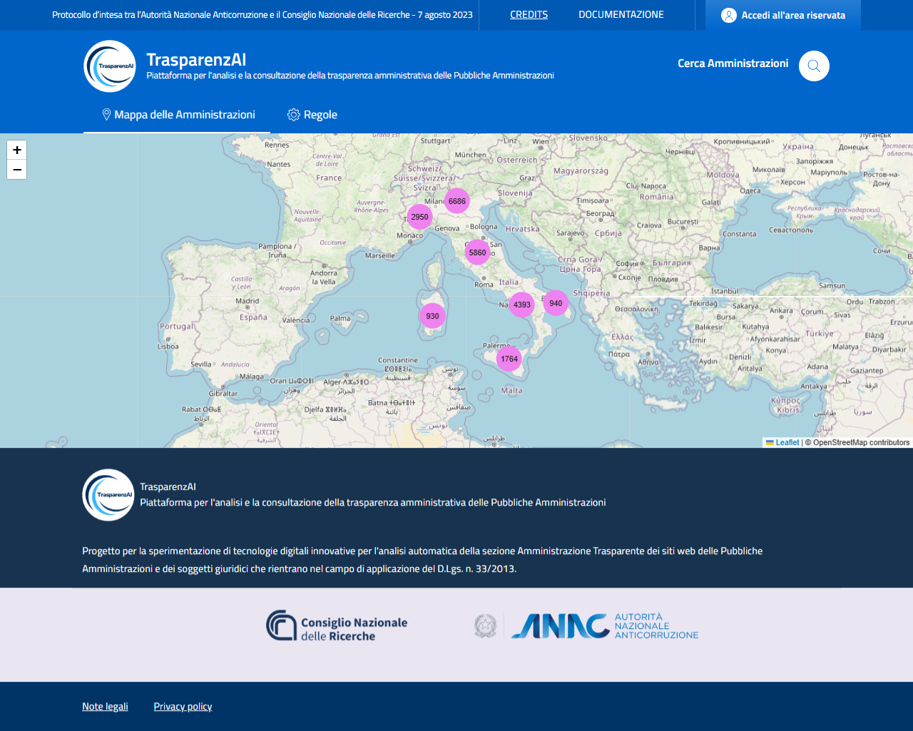
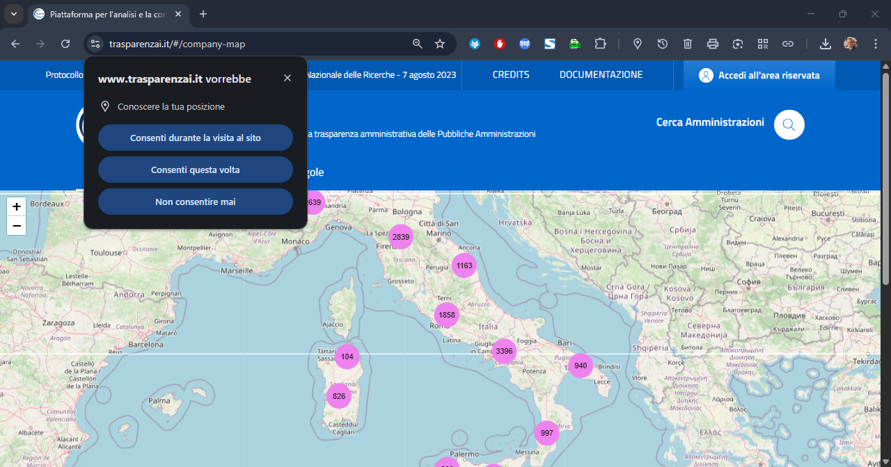
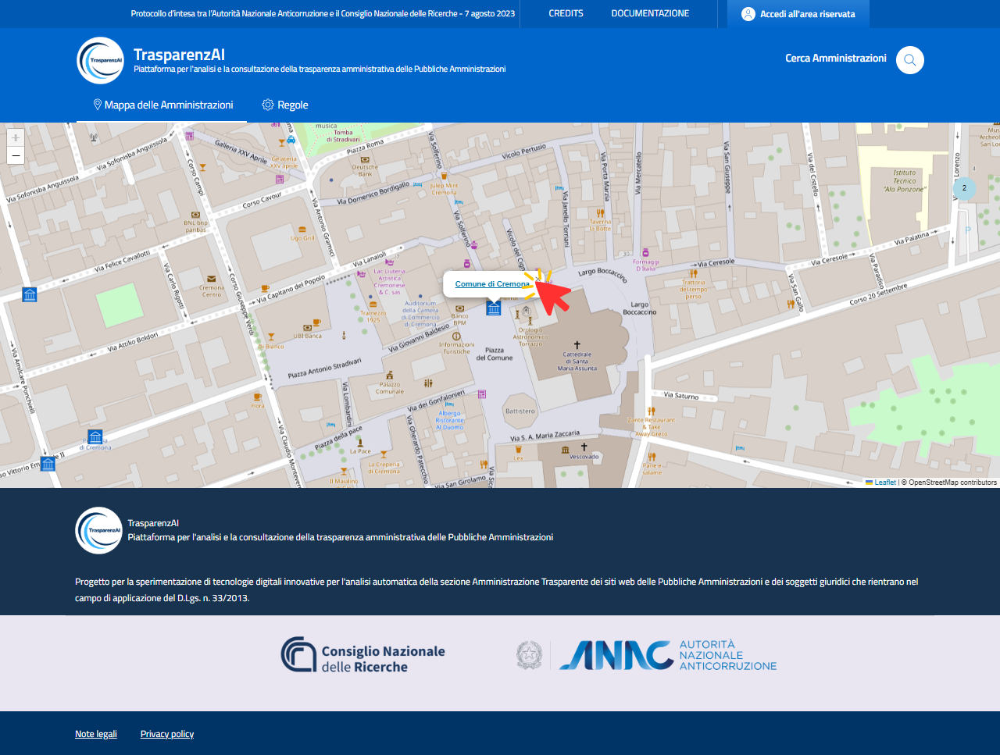

Menù utente "Mappa delle Amministrazioni"
=========================================

Il menù "Mappa delle Amministrazioni" (:numref:`user-mappa_amministrazioni-img`) accede alla funzione di visualizzazione geografica e ricerca interattiva delle Amministrazioni.

.. _user-mappa_amministrazioni-img:

  Menù Utente "Mappa delle Amministrazioni" - immagine generale

L'utente può individuare l'Amministrazione che intende visualizzare attraverso la navigazione della mappa geografica o attivando la rilevazione della geolocalizzazione del dispositivo (:numref:`user-mappa_amministrazioni-posizione-img`). Nel caso di attivazione della geolocalizzazione, la piattaforma visualizza le Amministrazioni presenti nell'area in cui è posizionato l'utente (si precisa che le coordinate geografiche di posizione sono gestite dal dispotivo utente e non vengono acquisite dalla piattaforma).

.. _user-mappa_amministrazioni-posizione-img:

  Menù Utente "Mappa delle Amministrazioni" - autorizzazione posizione

Utilizzando la funzione di "zoom" disponibile sul dispositivo utente (touch screen per i sistemi mobile e tablet, oppure la rotellina del mouse per i PC) è possibile ridimensionare la mappa fino al dettaglio della singola Amministrazione (:numref:`mappa_amministrazioni_selezione-img`), visualizzarne le informazioni e consultare i dati pubblicati della trasparenza amministrativa.

.. _user-mappa_amministrazioni_esempio-1-img:

  Menù Utente "Mappa delle Amministrazioni" - singola Amministrazione
