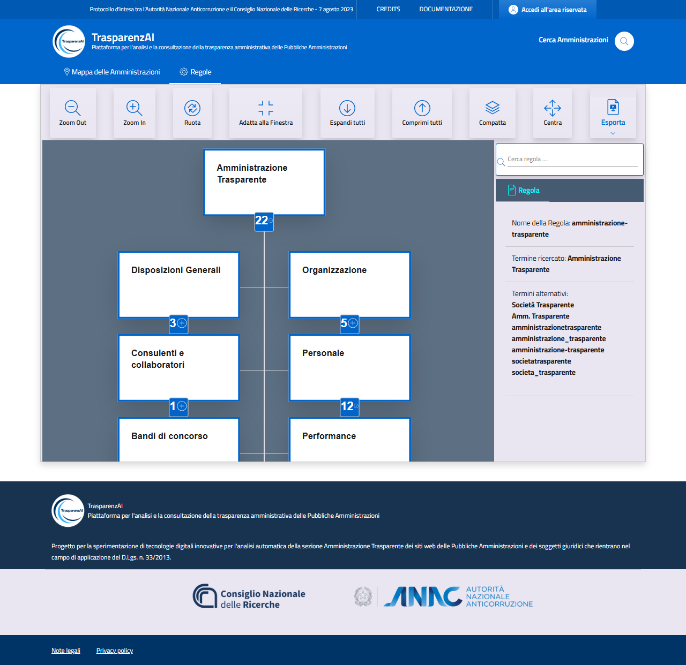

Menù Utente "Regole"
=============

Il menù "Regole" (:numref:`user-menu-regole-img`) permette all'Utente la navigazione interattiva dell'albero delle regole previste per i controlli sulla presenza delle informazioni di trasparenza ammnistrativa. L'albero delle regole, mostra le sezioni informative previste dalla normativa che le Amministrazioni pubblicano sui rispettivi siti web.

.. _user-menu-regole-img:

  Menù Utente "Regole"
